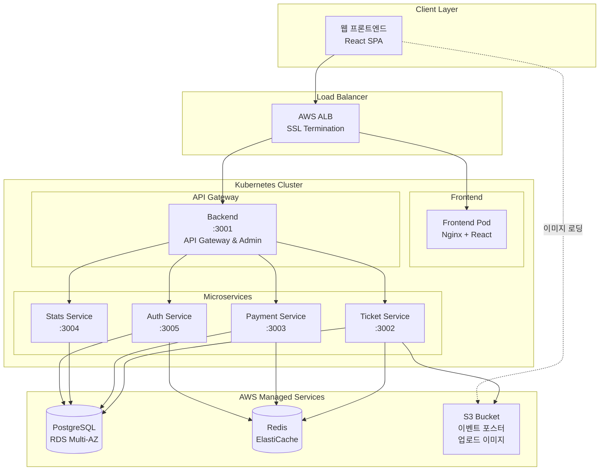
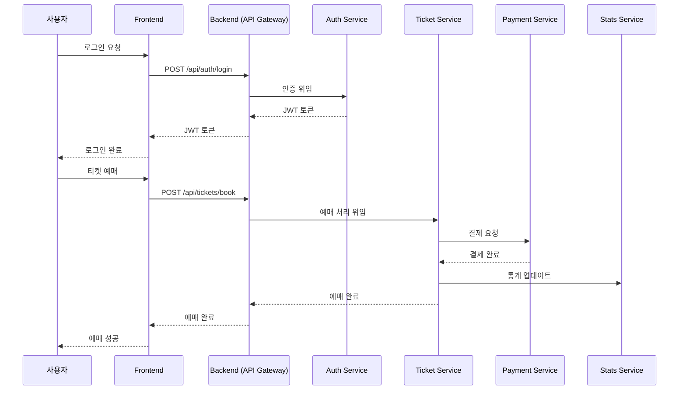
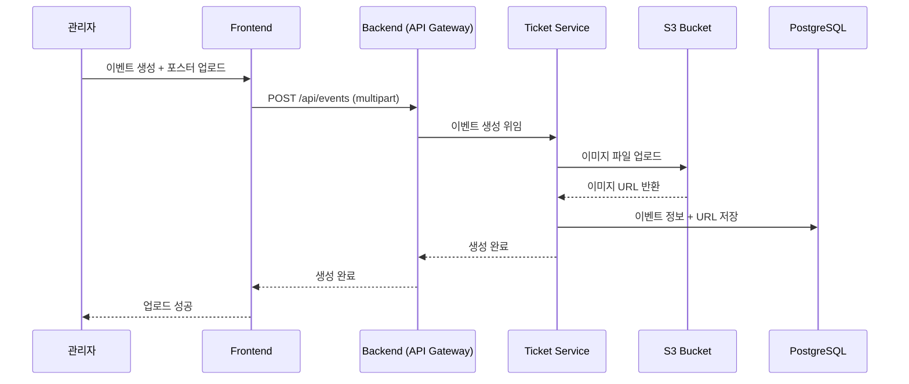
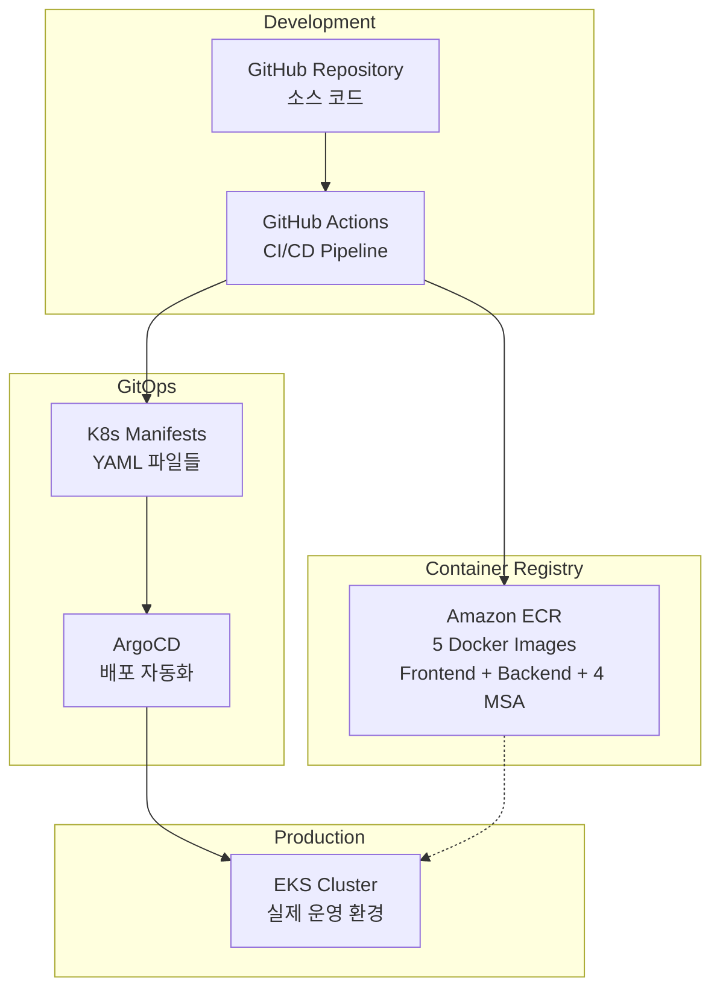
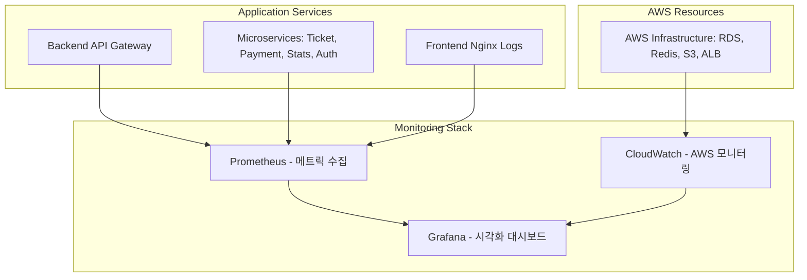
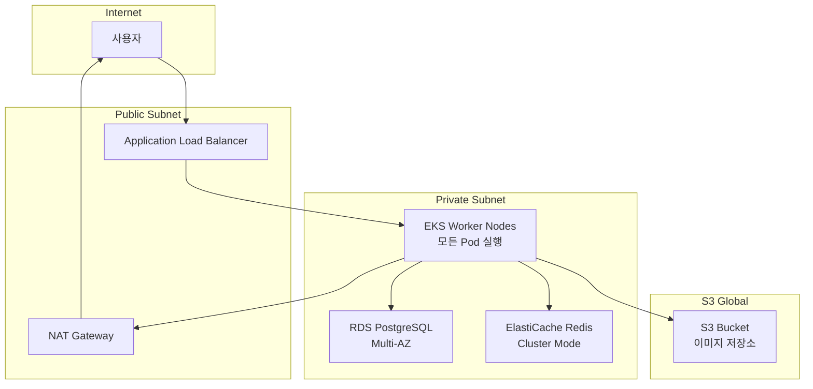
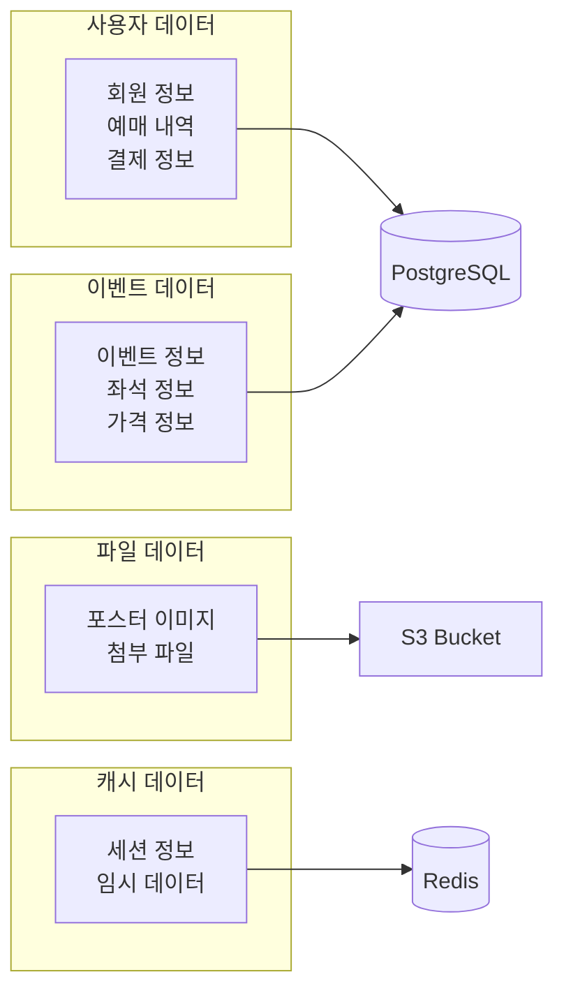

# 🎫 TIKETI - 이벤트 티켓 예매 플랫폼

> MSA 기반 실시간 티켓 예매 시스템 with Kubernetes & GitOps

[](https://kubernetes.io/)
[](https://argoproj.github.io/cd/)
[](https://nodejs.org/)
[](https://reactjs.org/)

## 📖 목차

- [소개](#-소개)
- [주요 기능](#-주요-기능)
- [기술 스택](#-기술-스택)
- [시스템 아키텍처](#-시스템-아키텍처)
- [빠른 시작](#-빠른-시작)
- [프로젝트 구조](#-프로젝트-구조)
- [API 문서](#-api-문서)
- [모니터링](#-모니터링)
- [배포](#-배포)
- [문서](#-문서)
- [기여](#-기여)

---

## 🎯 소개

**TIKETI**는 콘서트, 뮤지컬, 스포츠 경기 등 다양한 이벤트의 티켓을 실시간으로 예매할 수 있는 티케팅 플랫폼입니다.

### 핵심 특징

- ✨ **Hybrid MSA Architecture**: API Gateway + 4개 독립 마이크로서비스
- 🚀 **GitOps with ArgoCD**: 선언적 배포 및 자동 동기화
- 🔄 **Real-time Sync**: WebSocket 기반 실시간 좌석 상태 동기화
- 📊 **Full Observability**: Prometheus, Grafana, Loki 통합 모니터링
- ☁️ **Cloud Native**: Kubernetes (EKS) & AWS 서비스 완전 활용
- 🔐 **Secure by Default**: JWT 인증, Secret 관리, HTTPS
- ⚡ **High Performance**: Redis 캐싱, Connection Pooling, HPA

---

## ✨ 주요 기능

### 사용자 기능
- 🔐 **회원 인증**: JWT 기반 로그인/회원가입
- 🔍 **이벤트 검색**: 카테고리, 날짜, 장소별 검색
- 🪑 **실시간 좌석 선택**: WebSocket 기반 좌석 상태 실시간 동기화
- ⏳ **대기열 시스템**: Redis 기반 공정한 티켓팅 대기열
- 💳 **다양한 결제 수단**: Toss Payments, Naver Pay, Kakao Pay 등
- 📱 **예약 관리**: 내 예약 조회, 취소, 환불

### 관리자 기능
- 📊 **실시간 대시보드**: 매출, 예약, 이벤트 통계
- 🎭 **이벤트 관리**: 생성, 수정, 삭제, 좌석 배치
- 👥 **예약 관리**: 전체 예약 조회, 상태 변경
- 📈 **통계 분석**: 일별/시간별 매출, 전환율, 결제 수단별 분석
---

## 🛠 기술 스택

### Frontend


- **React 18.2** - UI 프레임워크
- **React Router 6** - 클라이언트 라우팅
- **Socket.IO Client** - 실시간 통신
- **Recharts** - 데이터 시각화
- **Toss Payments SDK** - 결제 연동

### Backend (Microservices)


- **Node.js 18+** - 런타임
- **Express.js** - 웹 프레임워크
- **PostgreSQL 15** - 주 데이터베이스 (MSA 스키마 분리)
- **DragonflyDB** - Redis 호환 캐시/대기열
- **Socket.IO** - WebSocket 서버
- **JWT** - 인증 토큰
- **Winston** - 구조화된 로깅

### Infrastructure


- **Kubernetes 1.28+** - 컨테이너 오케스트레이션
- **ArgoCD** - GitOps 배포
- **GitHub Actions** - CI/CD 자동화
- **Kustomize** - K8s 매니페스트 관리
- **Kind** - 로컬 K8s 클러스터

### Monitoring


- **Prometheus** - 메트릭 수집
- **Grafana** - 시각화 대시보드
- **Loki** - 로그 집계
- **Promtail** - 로그 수집

### AWS Services (Production)
- **EKS** - Managed Kubernetes
- **RDS (PostgreSQL)** - Managed Database
- **ElastiCache (Redis)** - Managed Cache
- **S3** - 이미지 스토리지
- **ECR** - Docker Registry
- **ALB** - Load Balancer
- **Route53** - DNS
- **CloudWatch** - 추가 모니터링

---

## 🏗 시스템 아키텍처

### MSA 서비스 구성 (API Gateway + 4개 MSA)



### 서비스별 역할

| 서비스 | 포트 | 역할 | 주요 기능 | 데이터베이스 스키마 |
|--------|------|------|-----------|-------------------|
| **Backend** | 3001 | API Gateway | 통합 API, 관리자 기능, 프록시 | `all schemas` |
| **Ticket Service** | 3002 | 티켓 관리 | 이벤트 생성, 티켓 예매, 좌석 관리, 이미지 업로드 | `ticket_schema` |
| **Payment Service** | 3003 | 결제 처리 | 결제 요청, 결제 검증, 환불 처리 | `payment_schema` |
| **Stats Service** | 3004 | 통계/분석 | 매출 통계, 사용자 분석, 대시보드 | `stats_schema` |
| **Auth Service** | 3005 | 인증/인가 | 회원가입, 로그인, JWT 토큰 관리 | `auth_schema` |

### (사용자) 티켓 예매 플로우


### (관리자) 이벤트 포스터 업로드 플로우


### 배포 아키텍처 



### 모니터링 구조


### 네트워킹 구조


### 데이터 플로우

---

## 🚀 빠른 시작

### 사전 요구사항

- **Docker Desktop** (v4.0+)
- **Node.js** (v18+)
- **Git**

### 로컬 개발환경 실행

```bash
# 1. 프로젝트 클론
git clone https://github.com/cchriscode/tiketi.git
cd tiketi

# 2. 환경 변수 설정
cp .env.example .env
# .env 파일을 실제 환경에 맞게 수정

# 3. Docker Compose로 전체 시스템 실행
docker-compose up -d

# 4. 각 서비스 헬스체크
curl http://localhost:3001/health  # Backend (API Gateway)
curl http://localhost:3002/health  # Ticket Service
curl http://localhost:3003/health  # Payment Service
curl http://localhost:3004/health  # Stats Service
curl http://localhost:3005/health  # Auth Service

# 5. 애플리케이션 접속
# Frontend: http://localhost:3000
```

### Kubernetes 환경 배포 (EKS)

```bash
# 1. EKS 클러스터 연결
aws eks update-kubeconfig --region ap-northeast-2 --name tiketi-cluster

# 2. 네임스페이스 생성
kubectl create namespace tiketi

# 3. 애플리케이션 배포
kubectl apply -f k8s/base/

# 4. ArgoCD 설치 및 설정
kubectl create namespace argocd
kubectl apply -n argocd -f https://raw.githubusercontent.com/argoproj/argo-cd/stable/manifests/install.yaml
kubectl apply -f argocd/applications/
```

### 기본 계정

#### 관리자
- **Email**: `admin@tiketi.com`
- **Password**: `admin123`
- **관리자 페이지**: http://localhost:3000/admin

---

## 📁 프로젝트 구조

```
tiketi/
├── .github/workflows/        # GitHub Actions CI/CD
│   ├── backend-ci-cd.yml     # API Gateway
│   ├── auth-ci-cd.yml        # Auth Service
│   ├── ticket-ci-cd.yml      # Ticket Service
│   ├── payment-ci-cd.yml     # Payment Service
│   ├── stats-ci-cd.yml       # Stats Service
│   └── frontend-ci-cd.yml    # Frontend
│
├── argocd/                   # ArgoCD GitOps 설정
│   ├── applications/         # ArgoCD Applications
│   └── projects/             # ArgoCD Projects
│
├── backend/                  # Backend (API Gateway)
│   ├── src/
│   │   ├── routes/          # API 라우팅 & 프록시
│   │   ├── middleware/      # 인증, 로깅
│   │   └── services/        # 비즈니스 로직
│   ├── Dockerfile
│   └── package.json
│
├── services/                 # 마이크로서비스 (4개)
│   ├── auth/                # 인증 서비스 (:3005)
│   │   ├── src/
│   │   ├── Dockerfile
│   │   └── package.json
│   ├── ticket/              # 티켓 서비스 (:3002)
│   ├── payment/             # 결제 서비스 (:3003)
│   └── stats/               # 통계 서비스 (:3004)
│
├── frontend/                 # React Frontend
│   ├── src/
│   │   ├── components/      # 재사용 컴포넌트
│   │   ├── pages/           # 페이지 컴포넌트
│   │   ├── services/        # API 클라이언트
│   │   └── hooks/           # 커스텀 훅
│   └── Dockerfile
│
├── k8s/                      # Kubernetes 매니페스트
│   ├── base/                # 기본 리소스
│   │   ├── backend-deployment.yaml
│   │   ├── auth-deployment.yaml
│   │   ├── ticket-deployment.yaml
│   │   ├── payment-deployment.yaml
│   │   ├── stats-deployment.yaml
│   │   └── services.yaml
│   └── overlays/            # 환경별 설정
│
├── monitoring/               # 모니터링 설정
│   ├── prometheus/
│   └── grafana/
│
├── docker-compose.yml        # 로컬 개발환경
├── .env.example             # 환경변수 템플릿
└── README.md                # 본 문서
```

---

## 📚 API 문서

### 주요 엔드포인트

#### Backend (API Gateway - :3001)
```
# 통합 API 엔드포인트 (프록시 방식)
GET  /api/auth/*             # → Auth Service로 프록시
GET  /api/events/*           # → Ticket Service로 프록시
GET  /api/payments/*         # → Payment Service로 프록시
GET  /api/stats/*            # → Stats Service로 프록시

# 관리자 전용 API
GET  /api/admin/dashboard    # 관리자 대시보드
POST /api/admin/events       # 관리자 이벤트 관리
```

#### 마이크로서비스별 직접 API

**인증 (Auth Service - :3005)**
```
POST /api/auth/register      # 회원가입
POST /api/auth/login         # 로그인
GET  /api/auth/me            # 내 정보 조회
POST /api/auth/logout        # 로그아웃
```

**이벤트 & 티켓 (Ticket Service - :3002)**
```
GET  /api/events             # 이벤트 목록
POST /api/events             # 이벤트 생성
GET  /api/events/:id         # 이벤트 상세
POST /api/tickets/book       # 티켓 예매
GET  /api/tickets/my         # 내 예매 내역
```

**결제 (Payment Service - :3003)**
```
POST /api/payments/create    # 결제 생성
POST /api/payments/confirm   # 결제 확인
POST /api/payments/refund    # 환불 처리
GET  /api/payments/history   # 결제 내역
```

**통계 (Stats Service - :3004)**
```
GET  /api/stats/sales        # 매출 통계
GET  /api/stats/users        # 사용자 통계
GET  /api/stats/events       # 이벤트 통계
GET  /api/stats/dashboard    # 대시보드 데이터
```

### API 문서 접속
- **Backend (통합)**: http://localhost:3001/api-docs
- **Auth Service**: http://localhost:3005/api-docs
- **Ticket Service**: http://localhost:3002/api-docs
- **Payment Service**: http://localhost:3003/api-docs
- **Stats Service**: http://localhost:3004/api-docs

자세한 API 명세는 [PROJECT_SPECIFICATION.md](./PROJECT_SPECIFICATION.md#7-api-명세)를 참고하세요.

---

## 📊 모니터링

### 접속 URL (프로덕션)
- **웹 애플리케이션**: https://tiketi.store
- **관리자 대시보드**: https://tiketi.store/admin
- **Grafana**: https://grafana.tiketi.store
  - 기본 계정: admin / admin
- **Prometheus**: https://prometheus.tiketi.store

### 개발 환경 URL
- **프론트엔드**: http://localhost:3000
- **Backend (API Gateway)**: http://localhost:3001
- **각 마이크로서비스**: http://localhost:3002-3005
- **Grafana**: http://localhost:30006
  - 기본 계정: admin / admin
- **Prometheus**: 각 서비스의 `/metrics` 엔드포인트

#### 대시보드
- **시스템 개요**: Pod 상태, CPU/Memory, 네트워크
- **애플리케이션 메트릭**: Request Rate, Response Time, Error Rate
- **비즈니스 메트릭**: 매출, 예약 건수, 전환율
- **로그 검색**: Loki 통합 로그 뷰어

#### 주요 메트릭
- `http_request_duration_seconds` - API 응답 시간
- `tiketi_daily_revenue` - 일별 매출
- `tiketi_reservations_total` - 총 예약 건수
- `tiketi_seats_available` - 이벤트별 잔여 좌석

#### 성능 목표 🎯
- **동시 사용자**: 최대 **10,000명**
- **처리량**: **1,000 TPS**
- **응답 시간**: **200ms (p95)**
- **가용성**: 99.9% 이상
- **데이터베이스 응답 시간**: < 100ms

---

## 🚢 배포

### GitOps with ArgoCD

#### 배포 흐름
```
1. 코드 Push (main/develop)
   ↓
2. GitHub Actions 실행
   - Docker 이미지 빌드
   - ECR에 푸시
   - Kustomize 매니페스트 업데이트
   ↓
3. Git 커밋 & 푸시
   ↓
4. ArgoCD가 변경 감지 (3분마다 폴링)
   ↓
5. 자동 배포 (dev/staging) 또는 수동 승인 (prod)
   ↓
6. Kubernetes에 Apply (Rolling Update)
```

#### ArgoCD 설치
```bash
# ArgoCD 설치
kubectl create namespace argocd
kubectl apply -n argocd -f https://raw.githubusercontent.com/argoproj/argo-cd/stable/manifests/install.yaml

# App of Apps 배포
kubectl apply -f argocd/applications/app-of-apps.yaml

# ArgoCD UI 접속
kubectl port-forward svc/argocd-server -n argocd 8080:443
# URL: https://localhost:8080
```

### CI/CD 환경 변수

GitHub Secrets에 다음 변수 설정 필요:

```
AWS_ACCOUNT_ID          # AWS 계정 ID
AWS_ROLE_ARN            # OIDC Role ARN
DISCORD_WEBHOOK         # Discord 알림 (선택)
```

---

## 📖 문서

### 주요 문서
- **[QUICK_START.md](./QUICK_START.md)** - Windows 환경 빠른 시작
- **[QUICK_START_MAC.md](./QUICK_START_MAC.md)** - macOS 환경 빠른 시작
- **[PROJECT_SPECIFICATION.md](./PROJECT_SPECIFICATION.md)** - 프로젝트 상세 명세서
  - 기술 스택, 아키텍처, API 명세, DB 설계
  - 포트/네트워크, Kubernetes, CI/CD, GitOps
  - 모니터링, 보안, 성능 최적화
- **[KIND_DEPLOYMENT_GUIDE.md](./KIND_DEPLOYMENT_GUIDE.md)** - Kind 배포 가이드
- **[TROUBLESHOOTING_COMPLETE_GUIDE.md](./TROUBLESHOOTING_COMPLETE_GUIDE.md)** - 문제 해결

### 기술 문서 (claudedocs/)
- `MSA_SYSTEM_SPEC.md` - MSA 상세 스펙
- `ARGOCD_IMPLEMENTATION_ROADMAP.md` - ArgoCD 구현 로드맵
- `K8S_KUSTOMIZE_MIGRATION_COMPLETE.md` - Kustomize 마이그레이션
- `GITHUB_ACTIONS_ARGOCD_COMPLETE.md` - GitHub Actions + ArgoCD

---

## 🧪 테스트

### 단위 테스트
```bash
# Backend (API Gateway) 테스트
cd backend && npm test

# 각 마이크로서비스별 테스트
cd services/auth && npm test
cd services/ticket && npm test
cd services/payment && npm test
cd services/stats && npm test

# 프론트엔드 테스트
cd frontend && npm test
```

### 통합 테스트
```bash
# API 통합 테스트
npm run test:integration

# 서비스 간 통신 테스트
npm run test:services
```

### 헬스 체크
```bash
# 모든 서비스 Health 확인
curl http://localhost:3001/health  # Backend (API Gateway)
curl http://localhost:3002/health  # Ticket Service
curl http://localhost:3003/health  # Payment Service
curl http://localhost:3004/health  # Stats Service
curl http://localhost:3005/health  # Auth Service
```

---

## 🤝 기여

### 브랜치 전략
- `main` - Production 배포
- `dev` - Development 배포
- `feature/*` - 기능 개발
- `bugfix/*` - 버그 수정

### 커밋 컨벤션
```
feat: 새로운 기능 추가
fix: 버그 수정
docs: 문서 수정
style: 코드 포맷팅
refactor: 코드 리팩토링
test: 테스트 코드
chore: 빌드, 설정 변경
```

### Pull Request
1. Feature 브랜치 생성
2. 변경사항 커밋
3. PR 생성 (develop 브랜치로)
4. 코드 리뷰 & CI 통과
5. Merge

---

#### 📝 이 프로젝트는 학습 목적으로 제작되었습니다.

---
