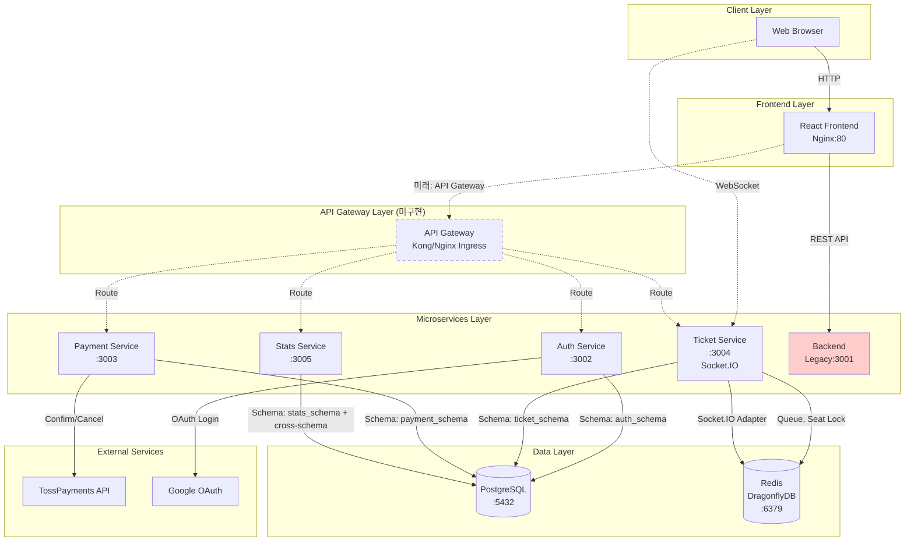
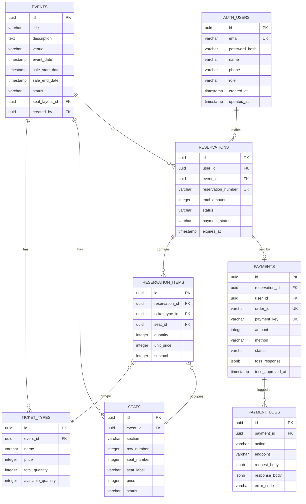
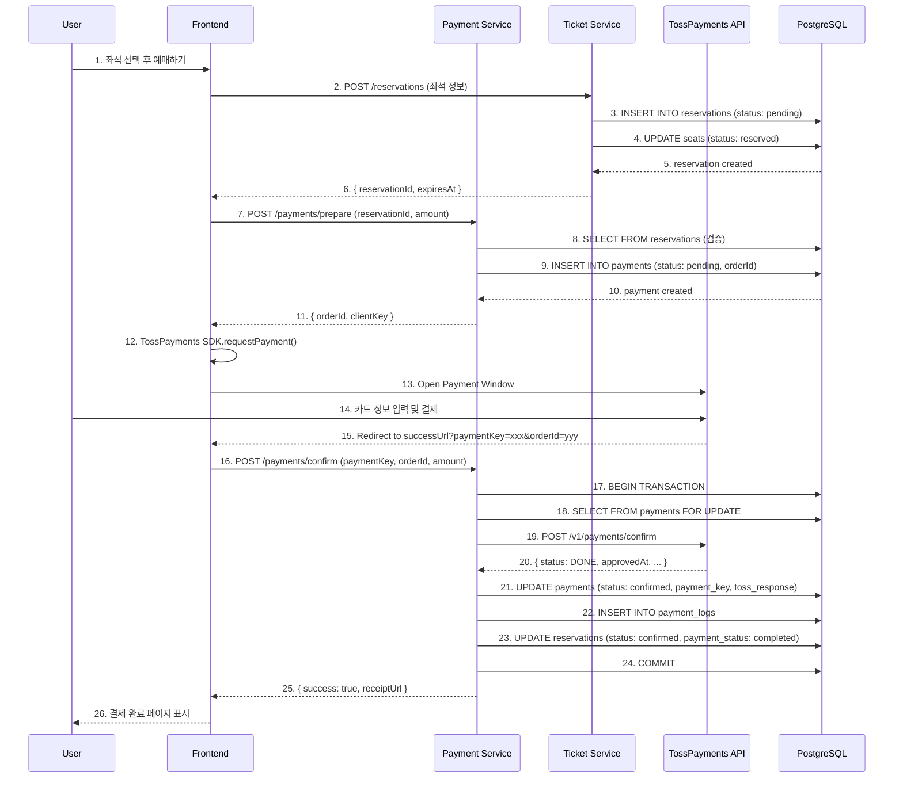
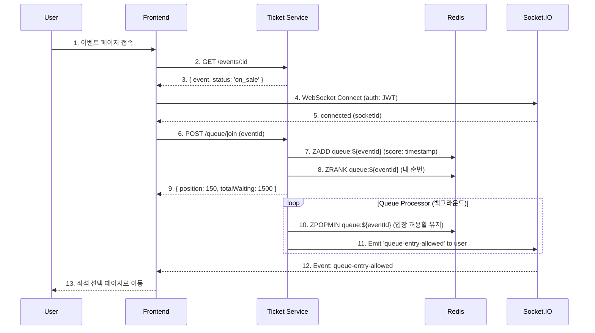
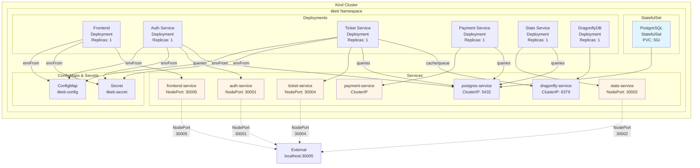

# TIKETI 프로젝트 종합 분석 보고서 (Part 2)

> 아키텍처 다이어그램, 코드 분석, 면접 질문
>
> 작성일: 2025-12-29

---

## 목차 (Part 2)

6. [Frontend 아키텍처 분석](#6-frontend-아키텍처-분석)
7. [Kubernetes 배포 전략](#7-kubernetes-배포-전략)
8. [코드 품질 및 장단점 분석](#8-코드-품질-및-장단점-분석)
9. [아키텍처 다이어그램](#9-아키텍처-다이어그램)
10. [기술적 의사결정 분석](#10-기술적-의사결정-분석)
11. [면접 질문 및 QnA](#11-면접-질문-및-qna)

---

## 6. Frontend 아키텍처 분석

### 6.1 전체 구조

**기술 스택:**
- React 18 (함수형 컴포넌트 + Hooks)
- React Router v6 (라우팅)
- Socket.IO Client (WebSocket 실시간 통신)
- Axios (HTTP 클라이언트)
- TossPayments SDK (결제)
- Recharts (통계 차트)

**디렉토리 구조:**
```
frontend/src/
├── components/          # 재사용 컴포넌트
│   ├── Header.js
│   ├── EventCard.js
│   ├── WaitingRoomModal.js
│   └── ConnectionStatus.js
├── pages/              # 페이지 컴포넌트
│   ├── Home.js
│   ├── EventDetail.js
│   ├── SeatSelection.js
│   ├── Payment.js
│   ├── PaymentCallback.js
│   ├── Login.js
│   ├── Register.js
│   └── admin/
│       ├── Dashboard.js
│       ├── Events.js
│       └── Statistics.js
├── hooks/              # Custom Hooks
│   ├── useSocket.js
│   └── useCountdown.js
├── services/           # API 클라이언트
│   └── api.js
├── shared/             # 공유 상수
│   └── constants.js
├── App.js              # 메인 앱
└── index.js            # 진입점
```

### 6.2 라우팅 구조

**파일:** `frontend/src/App.js:1`

```javascript
<Routes>
  {/* Public Routes */}
  <Route path="/" element={<Home />} />
  <Route path="/events/:id" element={<EventDetail />} />
  <Route path="/login" element={<Login />} />
  <Route path="/register" element={<Register />} />
  <Route path="/news" element={<News />} />

  {/* Protected Routes (로그인 필요) */}
  <Route path="/my-reservations" element={<PrivateRoute><MyReservations /></PrivateRoute>} />
  <Route path="/events/:eventId/seats" element={<PrivateRoute><SeatSelection /></PrivateRoute>} />
  <Route path="/payment/:reservationId" element={<PrivateRoute><Payment /></PrivateRoute>} />
  <Route path="/payment/success" element={<PrivateRoute><PaymentCallback /></PrivateRoute>} />

  {/* Admin Routes (관리자 전용) */}
  <Route path="/admin" element={<AdminRoute><AdminDashboard /></AdminRoute>} />
  <Route path="/admin/events" element={<AdminRoute><AdminEvents /></AdminRoute>} />
  <Route path="/admin/statistics" element={<AdminRoute><AdminStatistics /></AdminRoute>} />
</Routes>
```

**인증 가드:**
```javascript
const PrivateRoute = ({ children }) => {
  const token = localStorage.getItem('token');
  return token ? children : <Navigate to="/login" />;
};

const AdminRoute = ({ children }) => {
  const token = localStorage.getItem('token');
  const user = JSON.parse(localStorage.getItem('user') || '{}');

  return token && user.role === 'admin' ? children : <Navigate to="/" />;
};
```

### 6.3 API 통신 구조

**파일:** `frontend/src/services/api.js:1`

#### 6.3.1 동적 API URL 설정

```javascript
const getApiUrl = () => {
  if (process.env.REACT_APP_API_URL) {
    return process.env.REACT_APP_API_URL;
  }

  const hostname = window.location.hostname;

  // localhost: use localhost:3001
  if (hostname === 'localhost' || hostname === '127.0.0.1') {
    return 'http://localhost:3001';
  }

  // WSL IP or other local IP: use same IP with port 3001
  if (hostname.match(/^(172\.|192\.168\.|10\.)/)) {
    return `http://${hostname}:3001`;
  }

  // Production: use relative URL (Nginx proxy)
  return '';
};
```

**설명:**
- 개발 환경: `localhost:3001` (레거시 백엔드)
- WSL 환경: WSL IP + `:3001`
- 프로덕션: Nginx 리버스 프록시 사용 (상대 경로)

#### 6.3.2 Axios 인터셉터

```javascript
// Request Interceptor: JWT 토큰 자동 추가
api.interceptors.request.use((config) => {
  const token = localStorage.getItem('token');
  if (token) {
    config.headers.Authorization = `Bearer ${token}`;
  }
  return config;
});

// Response Interceptor: 401 에러 처리
api.interceptors.response.use(
  (response) => response,
  (error) => {
    if (error.response?.status === 401) {
      localStorage.removeItem('token');
      localStorage.removeItem('user');
      alert('인증이 필요합니다. 로그인해주세요.');
      window.location.href = '/login';
    }
    return Promise.reject(error);
  }
);
```

#### 6.3.3 API 모듈화

```javascript
export const authAPI = {
  register: (data) => api.post('/auth/register', data),
  login: (data) => api.post('/auth/login', data),
};

export const eventsAPI = {
  getAll: (params) => api.get('/events', { params }),
  getById: (id) => api.get(`/events/${id}`),
};

export const reservationsAPI = {
  create: (data) => api.post('/reservations', data),
  getMy: () => api.get('/reservations/my'),
  cancel: (id) => api.post(`/reservations/${id}/cancel`),
};

export const paymentsAPI = {
  process: (data) => api.post('/payments/process', data),
};
```

**사용 예시:**
```javascript
import { eventsAPI } from '../services/api';

const [events, setEvents] = useState([]);

useEffect(() => {
  const fetchEvents = async () => {
    const response = await eventsAPI.getAll({ status: 'on_sale' });
    setEvents(response.data.events);
  };
  fetchEvents();
}, []);
```

### 6.4 WebSocket 통신 (Socket.IO)

**파일:** `frontend/src/hooks/useSocket.js:1`

#### 6.4.1 기본 Socket 연결 Hook

```javascript
export function useSocket(eventId) {
  const socketRef = useRef(null);
  const [isConnected, setIsConnected] = useState(false);
  const [isReconnecting, setIsReconnecting] = useState(false);

  useEffect(() => {
    const token = localStorage.getItem('token');

    const socket = io(SOCKET_URL, {
      auth: { token },  // JWT 토큰 전달
      transports: ['websocket', 'polling'],
      reconnection: true,
      reconnectionAttempts: 5,
    });

    socketRef.current = socket;

    socket.on('connect', () => {
      setIsConnected(true);
      if (eventId) {
        socket.emit('join-event', { eventId });
      }
    });

    socket.on('reconnect', (attemptNumber) => {
      console.log(`Reconnected after ${attemptNumber} attempts`);
      setIsReconnecting(false);
    });

    socket.on('disconnect', () => {
      setIsConnected(false);
    });

    return () => {
      socket.disconnect();
    };
  }, [eventId]);

  return { socket: socketRef.current, isConnected, isReconnecting };
}
```

#### 6.4.2 대기열 실시간 업데이트 Hook

```javascript
export function useQueueUpdates(eventId, onQueueUpdate, onEntryAllowed) {
  const [isConnected, setIsConnected] = useState(false);

  useEffect(() => {
    const token = localStorage.getItem('token');
    const socket = io(SOCKET_URL, { auth: { token } });

    socket.on('connect', () => {
      setIsConnected(true);
      socket.emit('join-queue', { eventId });
    });

    // 대기열 업데이트 이벤트
    socket.on('queue-updated', (data) => {
      console.log('Queue updated:', data);
      if (onQueueUpdate) onQueueUpdate(data);
    });

    // 입장 허용 이벤트
    socket.on('queue-entry-allowed', (data) => {
      console.log('Entry allowed:', data);
      if (onEntryAllowed) onEntryAllowed(data);
    });

    return () => {
      socket.disconnect();
    };
  }, [eventId, onQueueUpdate, onEntryAllowed]);

  return { isConnected };
}
```

**사용 예시:**
```javascript
// WaitingRoomModal.js
const { isConnected } = useQueueUpdates(
  eventId,
  (data) => {
    // 대기 순번 업데이트
    setQueuePosition(data.position);
    setTotalWaiting(data.totalWaiting);
  },
  (data) => {
    // 입장 허용됨 -> 좌석 선택 페이지로 이동
    navigate(`/events/${eventId}/seats`);
  }
);
```

#### 6.4.3 좌석 실시간 동기화 Hook

```javascript
export function useSeatUpdates(eventId, onSeatUpdate) {
  const { socket, isConnected } = useSocket(null);

  useEffect(() => {
    if (!socket || !isConnected || !eventId) return;

    socket.emit('join-seat-selection', { eventId });

    socket.on('seat-selected', (data) => {
      console.log('Seat selected:', data);
      if (onSeatUpdate) onSeatUpdate(data);
    });

    socket.on('seat-released', (data) => {
      console.log('Seat released:', data);
      if (onSeatUpdate) onSeatUpdate(data);
    });

    return () => {
      socket.off('seat-selected');
      socket.off('seat-released');
    };
  }, [socket, isConnected, eventId, onSeatUpdate]);

  return { socket, isConnected };
}
```

**사용 예시:**
```javascript
// SeatSelection.js
const { isConnected } = useSeatUpdates(eventId, (data) => {
  // 다른 사용자가 좌석을 선택/해제했을 때 UI 업데이트
  setSeats((prevSeats) =>
    prevSeats.map((seat) =>
      seat.id === data.seatId
        ? { ...seat, status: data.status }
        : seat
    )
  );
});
```

### 6.5 상태 관리

**TIKETI는 별도의 상태 관리 라이브러리(Redux, Zustand 등)를 사용하지 않습니다.**

**이유:**
1. 애플리케이션 규모가 크지 않음
2. 대부분의 상태가 서버 데이터 (React Query 없이도 관리 가능)
3. 복잡한 전역 상태가 필요 없음

**현재 상태 관리 방식:**
- `useState`: 컴포넌트 로컬 상태
- `useEffect` + API 호출: 서버 데이터 페칭
- `localStorage`: 인증 토큰, 사용자 정보
- Custom Hooks: 재사용 가능한 로직 분리

**향후 개선 제안:**
- React Query 도입 → 서버 상태 관리 개선 (캐싱, 재시도, 낙관적 업데이트)
- Zustand 또는 Jotai → 간단한 전역 상태 관리 (사용자 정보, 테마 등)

### 6.6 결제 플로우 (TossPayments)

**파일:** `frontend/src/pages/Payment.js`

```javascript
const handlePayment = async () => {
  try {
    // 1. TossPayments SDK 로드
    const tossPayments = await loadTossPayments(clientKey);

    // 2. 결제창 열기
    await tossPayments.requestPayment('카드', {
      amount: reservation.total_amount,
      orderId: orderId,
      orderName: `${event.title} 예매`,
      successUrl: `${window.location.origin}/payment/success`,
      failUrl: `${window.location.origin}/payment/fail`,
    });
  } catch (error) {
    console.error('Payment error:', error);
    alert('결제 중 오류가 발생했습니다.');
  }
};
```

**결제 흐름:**
```
[사용자]            [Frontend]         [Payment Service]    [TossPayments]
   |                    |                      |                    |
   | 예매 완료          |                      |                    |
   |------------------->|                      |                    |
   |                    | POST /prepare        |                    |
   |                    |--------------------->|                    |
   |                    |<---------------------|                    |
   |                    | { orderId, clientKey }                    |
   |                    |                      |                    |
   | 결제하기 클릭      |                      |                    |
   |------------------->|                      |                    |
   |                    | TossPayments SDK     |                    |
   |                    | requestPayment()     |                    |
   |                    |------------------------------------->      |
   |                    |                      |                    |
   |                    |        결제창 (카드 정보 입력)            |
   |<--------------------------------------------------------------|
   |                    |                      |                    |
   | 결제 승인          |                      |                    |
   |------------------------------------------------------------------->
   |                    |                      |                    |
   |                    | Redirect to successUrl                    |
   |<------------------------------------------------------------------|
   |                    | ?paymentKey=xxx&orderId=yyy&amount=zzz    |
   |                    |                      |                    |
   |                    | POST /confirm        |                    |
   |                    |--------------------->|                    |
   |                    |                      | POST /v1/payments/confirm
   |                    |                      |------------------->|
   |                    |                      |<-------------------|
   |                    |<---------------------|                    |
   |                    | { success: true }    |                    |
   |                    |                      |                    |
   | 결제 완료 페이지   |                      |                    |
   |<-------------------|                      |                    |
```

---

## 7. Kubernetes 배포 전략

### 7.1 Kind 클러스터 구성

**Kind (Kubernetes in Docker):**
- 로컬 개발 환경용 Kubernetes 클러스터
- Docker 컨테이너로 Kubernetes 노드 실행

**클러스터 설정:** `k8s/kind-config.yaml`
```yaml
kind: Cluster
apiVersion: kind.x-k8s.io/v1alpha4
nodes:
  - role: control-plane
    extraPortMappings:
        - containerPort: 30000
          hostPort: 30000
        - containerPort: 30001
          hostPort: 30001
        - containerPort: 30002
          hostPort: 30002
        - containerPort: 30003
          hostPort: 30003
        - containerPort: 30004
          hostPort: 30004
        - containerPort: 30005
          hostPort: 30005
      - containerPort: 30006
        hostPort: 30006
  - role: worker
  - role: worker
```

**특징:**
- 1 Control Plane + 2 Worker 노드
- NodePort 매핑 (호스트에서 직접 접근 가능)

### 7.2 네임스페이스 전략

**파일:** `k8s/00-namespace.yaml`
```yaml
apiVersion: v1
kind: Namespace
metadata:
  name: tiketi
```

**모든 리소스는 `tiketi` 네임스페이스에 배포됩니다.**

### 7.3 ConfigMap과 Secret

#### 7.3.1 ConfigMap (비민감 설정)

**파일:** `k8s/01-configmap.yaml`
```yaml
apiVersion: v1
kind: ConfigMap
metadata:
  name: tiketi-config
  namespace: tiketi
data:
  NODE_ENV: "production"
  DB_HOST: "postgres-service"
  DB_PORT: "5432"
  DB_NAME: "tiketi"
  REDIS_URL: "redis://dragonfly-service:6379"
  FRONTEND_URL: "http://localhost:30005"
  BACKEND_URL: "http://localhost:30000"
```

#### 7.3.2 Secret (민감 정보)

**파일:** `k8s/02-secret.yaml`
```yaml
apiVersion: v1
kind: Secret
metadata:
  name: tiketi-secret
  namespace: tiketi
type: Opaque
data:
  DB_USER: dGlrZXRpX3VzZXI=              # tiketi_user (base64)
  DB_PASSWORD: dGlrZXRpX3Bhc3N3b3Jk      # tiketi_password (base64)
  JWT_SECRET: eW91ci1qd3Qtc2VjcmV0LWtleQ==  # your-jwt-secret-key (base64)
  TOSS_CLIENT_KEY: dGVzdF9ja19PZWxCZXJ6cVI=
  TOSS_SECRET_KEY: dGVzdF9za19PZWxCZXJ6cVI=
```

**주의:** 실제 운영 환경에서는 Kubernetes Secrets 대신 Vault, AWS Secrets Manager 사용 권장

### 7.4 데이터베이스 배포 (StatefulSet)

**파일:** `k8s/04-postgres.yaml`

```yaml
apiVersion: apps/v1
kind: StatefulSet
metadata:
  name: postgres
  namespace: tiketi
spec:
  serviceName: postgres-service
  replicas: 1
  selector:
    matchLabels:
      app: postgres
  template:
    metadata:
      labels:
        app: postgres
    spec:
      containers:
        - name: postgres
          image: postgres:16-alpine
          ports:
            - containerPort: 5432
          envFrom:
            - configMapRef:
                name: tiketi-config
            - secretRef:
                name: tiketi-secret
          volumeMounts:
            - name: postgres-storage
              mountPath: /var/lib/postgresql/data
  volumeClaimTemplates:
    - metadata:
        name: postgres-storage
      spec:
        accessModes: ["ReadWriteOnce"]
        resources:
          requests:
            storage: 5Gi
```

**StatefulSet을 사용하는 이유:**
- 고정된 네트워크 식별자 (postgres-0)
- 안정적인 스토리지 (PVC 자동 생성 및 유지)
- 순차적인 시작/종료 보장

**서비스:**
```yaml
apiVersion: v1
kind: Service
metadata:
  name: postgres-service
  namespace: tiketi
spec:
  type: ClusterIP
  selector:
    app: postgres
  ports:
    - port: 5432
      targetPort: 5432
```

### 7.5 마이크로서비스 배포

#### 7.5.1 Auth Service 배포

**파일:** `k8s/12-auth-service.yaml:1`

```yaml
apiVersion: apps/v1
kind: Deployment
metadata:
  name: auth-service
  namespace: tiketi
spec:
  replicas: 1
  selector:
    matchLabels:
      app: auth-service
  template:
    metadata:
      labels:
        app: auth-service
    spec:
      initContainers:
        # Wait for PostgreSQL
        - name: wait-for-postgres
          image: busybox:1.36
          command:
            - sh
            - -c
            - |
              until nc -z postgres-service 5432; do
                echo "Waiting for PostgreSQL..."
                sleep 2
              done
      containers:
        - name: auth-service
          image: tiketi-auth-service:local
          imagePullPolicy: IfNotPresent
          ports:
            - containerPort: 3002
          envFrom:
            - configMapRef:
                name: tiketi-config
            - secretRef:
                name: tiketi-secret
          env:
            - name: PORT
              value: "3002"
          livenessProbe:
            httpGet:
              path: /health
              port: 3002
            initialDelaySeconds: 30
            periodSeconds: 10
          readinessProbe:
            httpGet:
              path: /health
              port: 3002
            initialDelaySeconds: 20
            periodSeconds: 5
          resources:
            requests:
              memory: "128Mi"
              cpu: "100m"
            limits:
              memory: "256Mi"
              cpu: "500m"
---
apiVersion: v1
kind: Service
metadata:
  name: auth-service
  namespace: tiketi
spec:
  type: NodePort
  selector:
    app: auth-service
  ports:
    - port: 3002
      targetPort: 3002
      nodePort: 30001
```

**주요 특징:**
1. **Init Container**: PostgreSQL 준비 대기
2. **Health Checks**:
   - Liveness Probe: Pod가 살아있는지 확인 (실패 시 재시작)
   - Readiness Probe: 트래픽 수신 준비 완료 확인
3. **Resource Limits**: CPU/메모리 제한으로 리소스 보호
4. **NodePort**: 외부에서 `localhost:30001`으로 직접 접근 가능

#### 7.5.2 Ticket Service 배포

**파일:** `k8s/13-ticket-service.yaml:1`

```yaml
apiVersion: apps/v1
kind: Deployment
metadata:
  name: ticket-service
  namespace: tiketi
spec:
  replicas: 1
  template:
    spec:
      initContainers:
        - name: wait-for-postgres
          image: busybox:1.36
          command: ["sh", "-c", "until nc -z postgres-service 5432; do sleep 2; done"]
        - name: wait-for-dragonfly
          image: busybox:1.36
          command: ["sh", "-c", "until nc -z dragonfly-service 6379; do sleep 2; done"]
      containers:
        - name: ticket-service
          image: tiketi-ticket-service:local
          ports:
            - containerPort: 3004
          env:
            - name: PORT
              value: "3004"
            - name: REDIS_URL
              value: "redis://dragonfly-service:6379"
          resources:
            requests:
              memory: "256Mi"
              cpu: "200m"
            limits:
              memory: "512Mi"
              cpu: "1000m"
```

**Ticket Service는 다른 서비스보다 더 많은 리소스를 사용합니다:**
- Socket.IO 서버 운영
- 대기열 처리
- 좌석 실시간 동기화

### 7.6 Frontend 배포 (Nginx)

**파일:** `k8s/07-frontend.yaml`

```yaml
apiVersion: apps/v1
kind: Deployment
metadata:
  name: frontend
  namespace: tiketi
spec:
  replicas: 1
  template:
    spec:
      containers:
        - name: frontend
          image: tiketi-frontend:local
          ports:
            - containerPort: 80
          resources:
            requests:
              memory: "64Mi"
              cpu: "50m"
            limits:
              memory: "128Mi"
              cpu: "200m"
---
apiVersion: v1
kind: Service
metadata:
  name: frontend-service
  namespace: tiketi
spec:
  type: NodePort
  selector:
    app: frontend
  ports:
    - port: 80
      targetPort: 80
      nodePort: 30005
```

**Dockerfile (Multi-stage build):**
```dockerfile
# Stage 1: Build React app
FROM node:18-alpine AS build
WORKDIR /app
COPY package*.json ./
RUN npm ci
COPY . .
RUN npm run build

# Stage 2: Serve with Nginx
FROM nginx:alpine
COPY --from=build /app/build /usr/share/nginx/html
COPY nginx.conf /etc/nginx/conf.d/default.conf
EXPOSE 80
CMD ["nginx", "-g", "daemon off;"]
```

**Nginx 설정:**
```nginx
server {
    listen 80;
    root /usr/share/nginx/html;
    index index.html;

    location / {
        try_files $uri $uri/ /index.html;
    }

    # API 프록시 (향후 API Gateway 도입 시)
    # location /api/ {
    #     proxy_pass http://backend-service:3001/api/;
    # }
}
```

### 7.7 배포 순서

```bash
# 1. 클러스터 생성
kind create cluster --config k8s/kind-config.yaml

# 2. 네임스페이스 및 설정
kubectl apply -f k8s/00-namespace.yaml
kubectl apply -f k8s/01-configmap.yaml
kubectl apply -f k8s/02-secret.yaml

# 3. 데이터베이스
kubectl apply -f k8s/04-postgres.yaml
kubectl wait --for=condition=ready pod -l app=postgres -n tiketi --timeout=120s

# 4. Redis (DragonflyDB)
kubectl apply -f k8s/05-dragonfly.yaml

# 5. 백엔드 서비스들
docker build -t tiketi-auth-service:local ./services/auth-service
kind load docker-image tiketi-auth-service:local
kubectl apply -f k8s/12-auth-service.yaml

docker build -t tiketi-ticket-service:local ./services/ticket-service
kind load docker-image tiketi-ticket-service:local
kubectl apply -f k8s/13-ticket-service.yaml

# 6. 프론트엔드
docker build -t tiketi-frontend:local ./frontend
kind load docker-image tiketi-frontend:local
kubectl apply -f k8s/07-frontend.yaml

# 7. 상태 확인
kubectl get pods -n tiketi
kubectl get svc -n tiketi
```

### 7.8 Health Check 전략

**Liveness Probe (생존 확인):**
- 컨테이너가 정상 작동 중인지 확인
- 실패 시 Pod 재시작
- `initialDelaySeconds: 30` - 앱 시작 대기 시간
- `periodSeconds: 10` - 10초마다 체크

**Readiness Probe (준비 상태 확인):**
- 트래픽을 받을 준비가 되었는지 확인
- 실패 시 Service 엔드포인트에서 제거 (재시작 안 함)
- DB 연결 등 초기화 완료 확인

```javascript
// services/auth-service/src/server.js:21
app.get('/health', (req, res) => {
  res.json({
    status: 'ok',
    service: 'auth-service',
    timestamp: new Date().toISOString(),
  });
});
```

**향후 개선:**
```javascript
app.get('/health', async (req, res) => {
  try {
    // DB 연결 확인
    await db.query('SELECT 1');

    res.json({
      status: 'ok',
      service: 'auth-service',
      checks: {
        database: 'connected',
      },
    });
  } catch (error) {
    res.status(503).json({
      status: 'error',
      service: 'auth-service',
      checks: {
        database: 'disconnected',
      },
    });
  }
});
```

---

## 8. 코드 품질 및 장단점 분석

### 8.1 코드 장점

#### 8.1.1 아키텍처

✅ **MSA 전환 성공:**
- 모놀리식에서 도메인 기반 마이크로서비스로 분리
- 각 서비스의 책임 명확히 구분
- 독립적인 배포 가능

✅ **공통 패키지 라이브러리화:**
- `@tiketi/common`, `@tiketi/database`, `@tiketi/metrics`
- 중복 코드 제거
- 일관된 에러 처리 및 로깅

✅ **데이터베이스 스키마 분리:**
- Schema-based Multi-tenancy
- 서비스별 논리적 분리
- 마이그레이션 용이

#### 8.1.2 보안

✅ **인증/인가:**
- JWT 기반 토큰 인증
- bcrypt 비밀번호 해싱 (SALT_ROUNDS=10)
- 역할 기반 접근 제어 (RBAC: user, admin)

✅ **입력 검증:**
- 공통 Validator 함수 사용
- SQL Injection 방지 (Parameterized Query)
- XSS 방지 (React의 자동 이스케이프)

#### 8.1.3 확장성

✅ **수평 확장 대비:**
- Socket.IO Redis Adapter (멀티 인스턴스 동기화)
- Stateless 서비스 설계 (세션 정보를 DB/Redis에 저장)

✅ **Kubernetes 배포:**
- 컨테이너화 (Docker)
- Health Check
- Resource Limits

#### 8.1.4 개발 경험

✅ **개발 환경 자동화:**
- `setup-tiketi.ps1` - 원클릭 설치
- Docker Compose 대체 Kubernetes (Kind)
- Port Forwarding 자동화

✅ **문서화:**
- README.md
- 아키텍처 다이어그램
- 설치 가이드

---

### 8.2 코드 단점 및 개선 과제

#### 8.2.1 아키텍처 문제

❌ **API Gateway 부재:**
- 현재: 프론트엔드가 각 서비스 직접 호출
- 문제: CORS 설정 복잡, 인증 중복, 버전 관리 어려움
- 개선: Kong, Nginx Ingress, Spring Cloud Gateway 도입

❌ **서비스 간 통신 미흡:**
- 현재: 크로스 스키마 DB 쿼리
- 문제: 서비스 간 강한 결합, 독립성 훼손
- 개선: RESTful API 호출 또는 메시지 큐 도입

❌ **Circuit Breaker 부재:**
- 현재: 장애 전파 방지 메커니즘 없음
- 문제: 한 서비스 장애가 전체 시스템 마비 초래 가능
- 개선: Resilience4j, Polly 등 Circuit Breaker 패턴 적용

#### 8.2.2 데이터베이스 문제

❌ **단일 DB 인스턴스:**
- 현재: 모든 서비스가 하나의 PostgreSQL 공유
- 문제: SPOF (Single Point of Failure), 확장성 제한
- 개선: 서비스별 독립 DB 분리 또는 Read Replica 구성

❌ **트랜잭션 관리 미흡:**
- 현재: 일부 엔드포인트에서만 트랜잭션 사용
- 문제: 데이터 정합성 깨질 위험
- 개선: 모든 중요 작업에 트랜잭션 적용

❌ **인덱스 최적화 부족:**
- 문제: 대용량 데이터 조회 시 성능 저하 가능
- 개선: Slow Query 분석 및 인덱스 추가

#### 8.2.3 보안 문제

❌ **Secret 관리:**
- 현재: Kubernetes Secret (base64 인코딩)
- 문제: base64는 암호화가 아님 (디코딩 쉬움)
- 개선: HashiCorp Vault, AWS Secrets Manager 사용

❌ **HTTPS 미적용:**
- 현재: HTTP 통신
- 문제: 중간자 공격 (MITM) 가능
- 개선: Let's Encrypt 인증서 + Ingress TLS 설정

❌ **Rate Limiting 부재:**
- 문제: DDoS 공격, API 남용 방지 불가
- 개선: Nginx Ingress Rate Limit 또는 Redis 기반 Rate Limiter

#### 8.2.4 관찰성 (Observability) 부족

❌ **로깅 미흡:**
- 현재: console.log만 사용
- 문제: 구조화되지 않음, 검색 어려움
- 개선: Winston, Pino 등 구조화된 로거 사용

❌ **분산 트레이싱 부재:**
- 문제: 요청이 여러 서비스를 거칠 때 추적 불가
- 개선: OpenTelemetry + Jaeger/Zipkin 도입

❌ **모니터링 미흡:**
- 현재: Prometheus 메트릭 수집만 설정
- 문제: Grafana 대시보드 미구성, 알람 없음
- 개선: Grafana 대시보드 + Alertmanager 설정

#### 8.2.5 테스트 부재

❌ **단위 테스트 없음:**
- 문제: 리팩토링 시 기능 손상 위험
- 개선: Jest + Supertest로 API 테스트 작성

❌ **통합 테스트 없음:**
- 문제: 서비스 간 통합 검증 불가
- 개선: Testcontainers로 통합 테스트 환경 구축

❌ **E2E 테스트 없음:**
- 문제: 사용자 시나리오 검증 불가
- 개선: Playwright, Cypress로 E2E 테스트

#### 8.2.6 성능 문제

❌ **N+1 쿼리 가능성:**
```javascript
// 잠재적 N+1 문제
const events = await db.query('SELECT * FROM events');
for (const event of events.rows) {
  const tickets = await db.query('SELECT * FROM ticket_types WHERE event_id = $1', [event.id]);
}
```
- 개선: JOIN 또는 IN 절 사용

❌ **캐싱 전략 미흡:**
- 현재: Redis는 대기열/좌석 잠금만 사용
- 개선: 자주 조회되는 데이터 (이벤트 목록 등) 캐싱

❌ **페이지네이션 미흡:**
- 문제: 대용량 데이터 조회 시 성능 저하
- 개선: Limit/Offset 또는 Cursor 기반 페이지네이션

---

### 8.3 코드 스멜 (Code Smell)

#### 8.3.1 Magic Number

```javascript
// 🔴 Bad
const BCRYPT_SALT_ROUNDS = 10; // 왜 10인가?
const JWT_EXPIRES_IN = '7d';    // 왜 7일인가?
```

```javascript
// ✅ Good - 주석으로 이유 설명
const BCRYPT_SALT_ROUNDS = 10; // OWASP 권장 최소값
const JWT_EXPIRES_IN = '7d';    // UX 고려 (7일 동안 재로그인 불필요)
```

#### 8.3.2 에러 처리 불일치

```javascript
// 🔴 Bad - 일부 엔드포인트는 try-catch 없이 next(error) 의존
router.get('/events', async (req, res, next) => {
  const result = await db.query('SELECT * FROM events'); // 에러 시 자동 throw
  res.json(result.rows);
});
```

```javascript
// ✅ Good - 명시적 에러 처리
router.get('/events', async (req, res, next) => {
  try {
    const result = await db.query('SELECT * FROM events');
    res.json(result.rows);
  } catch (error) {
    next(error);
  }
});
```

#### 8.3.3 하드코딩된 값

```javascript
// 🔴 Bad
const SOCKET_URL = 'http://localhost:3001'; // 하드코딩
```

```javascript
// ✅ Good - 환경 변수 사용
const SOCKET_URL = process.env.SOCKET_URL || 'http://localhost:3001';
```

---

## 9. 아키텍처 다이어그램

### 9.1 전체 시스템 아키텍처



### 9.2 데이터베이스 스키마 구조



### 9.3 결제 플로우



### 9.4 대기열 시스템 흐름



### 9.5 Kubernetes 배포 구조



---

## 10. 기술적 의사결정 분석

### 10.1 왜 MSA로 전환했는가?

**결정:** 모놀리식 → 마이크로서비스 아키텍처

**이유:**
1. **독립적인 배포:** 각 서비스를 독립적으로 배포 가능
2. **기술 스택 유연성:** 서비스별로 다른 언어/프레임워크 선택 가능 (향후)
3. **확장성:** 트래픽이 많은 서비스만 스케일 아웃 가능
4. **장애 격리:** 한 서비스 장애가 전체 시스템에 영향 최소화
5. **팀 단위 개발:** 도메인별로 팀을 나눠 병렬 개발 가능

**트레이드오프:**
- 복잡도 증가 (네트워크 레이턴시, 분산 트랜잭션, 디버깅 어려움)
- 운영 오버헤드 (여러 서비스 모니터링, 배포 관리)

### 10.2 왜 Schema-based Multi-tenancy인가?

**결정:** 서비스별 독립 DB 대신 단일 DB의 스키마 분리

**이유:**
1. **비용 효율:** PostgreSQL 인스턴스 하나로 충분 (초기 단계)
2. **운영 단순화:** 백업/복구가 간편함
3. **크로스 스키마 쿼리:** 통계 서비스에서 모든 데이터 JOIN 가능
4. **마이그레이션 용이:** 기존 모놀리식 DB에서 점진적 전환 가능

**언제 독립 DB로 전환할 것인가?**
- 서비스별 트래픽 차이가 크게 발생할 때
- 서비스별 DB 기술을 다르게 가져가야 할 때 (PostgreSQL vs MongoDB)
- 완전한 독립성이 필요할 때

### 10.3 왜 Socket.IO를 사용했는가?

**결정:** WebSocket 라이브러리로 Socket.IO 선택

**이유:**
1. **자동 재연결:** 네트워크 끊김 시 자동 재연결
2. **Fallback 지원:** WebSocket 불가 시 Long Polling으로 자동 전환
3. **Room 지원:** 이벤트별, 대기열별 Room 구분 용이
4. **Redis Adapter:** 멀티 인스턴스 환경에서 메시지 동기화

**대안:**
- **Native WebSocket:** 가볍지만 재연결, Room 기능 직접 구현 필요
- **Server-Sent Events (SSE):** 단방향 통신만 가능

### 10.4 왜 TossPayments를 사용했는가?

**결정:** 결제 PG사로 TossPayments 선택

**이유:**
1. **국내 점유율 1위:** 안정성 검증됨
2. **간편한 SDK:** 프론트엔드 결제창 연동 쉬움
3. **다양한 결제 수단:** 카드, 가상계좌, 간편결제 등
4. **명확한 문서:** API 문서 상세함

**대안:**
- **PortOne (구 아임포트):** 여러 PG사 통합 지원
- **KG 이니시스:** 레거시 시스템에 많이 사용됨

### 10.5 왜 Kind를 사용했는가?

**결정:** 로컬 Kubernetes 환경으로 Kind 선택

**이유:**
1. **진짜 Kubernetes:** minikube보다 실제 K8s에 가까움
2. **멀티 노드 지원:** Control Plane + Worker 노드 구성 가능
3. **빠른 시작:** Docker 컨테이너로 노드 실행 (VM보다 빠름)
4. **CI/CD 적합:** GitHub Actions 등에서 사용 편리

**대안:**
- **minikube:** VM 기반, 단일 노드 환경
- **k3s:** 경량 Kubernetes, IoT/Edge 환경에 적합
- **Docker Desktop Kubernetes:** 가장 간단하지만 멀티 노드 불가

### 10.6 왜 Redis 대신 DragonflyDB를 사용했는가?

**결정:** Redis 호환 인메모리 DB로 DragonflyDB 선택

**이유:**
1. **Redis 프로토콜 호환:** Redis 클라이언트 그대로 사용
2. **멀티스레드:** Redis보다 성능 우수
3. **메모리 효율:** 동일 데이터에 메모리 사용량 적음
4. **무료 & 오픈소스:** Redis 7.0 라이센스 이슈 없음

**트레이드오프:**
- Redis만큼 검증되지 않음 (상대적으로 신생)

---

## 11. 면접 질문 및 QnA

### 11.1 아키텍처 설계

**Q1. 이 프로젝트를 MSA로 설계한 이유는 무엇인가요?**

**A:**
1. **독립적인 배포와 확장:** 티켓 서비스는 트래픽이 많을 때 스케일 아웃하고, Auth 서비스는 1개 인스턴스만 유지할 수 있습니다.
2. **장애 격리:** 결제 서비스 장애가 발생해도 이벤트 조회는 정상 작동합니다.
3. **기술 스택 유연성:** 향후 통계 서비스를 Python + Pandas로 전환하는 등 서비스별로 다른 기술을 선택할 수 있습니다.
4. **팀 단위 개발:** 도메인별로 팀을 나눠 병렬 개발이 가능합니다.

단, 현재는 API Gateway와 서비스 간 HTTP 통신이 구현되지 않아 완전한 MSA는 아니며, 이를 개선하고 있습니다.

---

**Q2. 서비스 간 통신을 크로스 스키마 DB 쿼리로 구현한 이유는?**

**A:**
초기 마이그레이션 단계에서 빠른 전환을 위해 선택했습니다. 장점은 트랜잭션 관리가 쉽고 네트워크 레이턴시가 없다는 것이지만, 단점은 서비스 간 강한 결합이 발생한다는 것입니다.

**향후 개선 방향:**
1. **동기 통신:** RESTful API 호출 (빠른 응답 필요 시)
2. **비동기 통신:** RabbitMQ/Kafka로 이벤트 기반 통신 (결제 완료 → 예약 상태 업데이트)

---

**Q3. API Gateway를 구현하지 않은 이유와 향후 계획은?**

**A:**
초기에는 프론트엔드가 각 서비스를 직접 호출하도록 설계했습니다. 이유는 빠른 MVP 개발을 위해서였습니다.

**현재 문제점:**
- 프론트엔드가 모든 서비스 엔드포인트를 알아야 함
- 인증 로직이 각 서비스에 중복됨
- CORS 설정 복잡함

**향후 계획:**
Kong 또는 Nginx Ingress를 사용하여 API Gateway를 도입하고, 다음 기능을 구현하겠습니다:
- 단일 엔드포인트 제공 (`/api/auth/*`, `/api/tickets/*`)
- 중앙화된 인증/인가
- Rate Limiting
- 로깅 및 모니터링

---

### 11.2 데이터베이스 설계

**Q4. Schema-based Multi-tenancy를 선택한 이유는?**

**A:**
서비스별 완전히 독립된 DB를 사용하는 것이 MSA의 이상적인 형태이지만, 초기 단계에서는 다음 이유로 스키마 분리를 선택했습니다:

**장점:**
1. **운영 단순화:** 백업/복구가 하나의 DB에서 이루어짐
2. **비용 절감:** PostgreSQL 인스턴스 1개만 필요
3. **크로스 스키마 쿼리:** 통계 서비스에서 JOIN 가능

**언제 독립 DB로 전환할 것인가?**
- 서비스별 트래픽 차이가 크게 발생할 때
- 서비스별 다른 DB 기술이 필요할 때 (e.g., 통계 서비스에 ClickHouse 사용)

---

**Q5. 예약(Reservation)과 결제(Payment)를 분산 트랜잭션으로 어떻게 관리하나요?**

**A:**
현재는 단일 DB를 사용하므로 PostgreSQL 트랜잭션으로 관리합니다:

```javascript
const client = await db.pool.connect();
try {
  await client.query('BEGIN');

  // 1. Payment 업데이트
  await client.query('UPDATE payment_schema.payments SET status = $1', ['confirmed']);

  // 2. Reservation 업데이트
  await client.query('UPDATE ticket_schema.reservations SET status = $1', ['confirmed']);

  await client.query('COMMIT');
} catch (error) {
  await client.query('ROLLBACK');
  throw error;
}
```

**향후 독립 DB로 전환 시:**
Saga 패턴 또는 2PC (Two-Phase Commit)를 사용하겠습니다.

**Saga 패턴 예시:**
1. Payment Service: 결제 승인 → `PaymentConfirmed` 이벤트 발행
2. Ticket Service: 이벤트 구독 → 예약 상태 업데이트
3. 실패 시: `PaymentCancelled` 이벤트 발행 → 보상 트랜잭션 실행

---

**Q6. 좌석 잠금(Seat Lock)을 Redis로 구현한 이유는?**

**A:**
동시에 여러 사용자가 같은 좌석을 선택하는 것을 방지하기 위해 Redis를 사용했습니다.

**구현 방식:**
```javascript
// 좌석 잠금 (TTL 5분)
await redis.setex(`seat:lock:${seatId}`, 300, userId);

// 좌석 잠금 해제
await redis.del(`seat:lock:${seatId}`);

// 좌석 잠금 확인
const lockOwner = await redis.get(`seat:lock:${seatId}`);
if (lockOwner && lockOwner !== userId) {
  throw new Error('Seat is already locked by another user');
}
```

**PostgreSQL로 구현하지 않은 이유:**
- DB에 부하 증가
- TTL 자동 만료 기능 없음 (크론 잡 필요)
- Redis가 더 빠름

---

### 11.3 실시간 통신

**Q7. Socket.IO를 선택한 이유는?**

**A:**
**요구사항:**
- 대기열 실시간 업데이트 (순번, 입장 알림)
- 좌석 실시간 동기화 (다른 사용자 선택 시 UI 업데이트)

**Socket.IO를 선택한 이유:**
1. **자동 재연결:** 네트워크 끊김 시 자동으로 재연결
2. **Fallback:** WebSocket 불가 환경에서 Long Polling으로 전환
3. **Room 기능:** 이벤트별로 Room을 나눠 효율적으로 메시지 전달
4. **Redis Adapter:** 멀티 인스턴스 환경에서 메시지 동기화

**Native WebSocket 대비 장점:**
- 재연결, Room 기능 직접 구현 불필요
- 프로덕션 환경에서 검증됨

---

**Q8. 멀티 인스턴스 환경에서 WebSocket 동기화는 어떻게 하나요?**

**A:**
Socket.IO의 Redis Adapter를 사용합니다.

**문제 상황:**
```
User A → Server 1 (Socket.IO)
User B → Server 2 (Socket.IO)

User A가 좌석 선택 → Server 1만 알고 있음
→ User B는 업데이트를 받지 못함
```

**해결 방법:**
```javascript
// Socket.IO Redis Adapter 설정
const { Server } = require('socket.io');
const { createAdapter } = require('@socket.io/redis-adapter');
const { createClient } = require('redis');

const io = new Server(server);

const pubClient = createClient({ url: 'redis://dragonfly-service:6379' });
const subClient = pubClient.duplicate();

Promise.all([pubClient.connect(), subClient.connect()]).then(() => {
  io.adapter(createAdapter(pubClient, subClient));
});
```

**동작 원리:**
1. Server 1에서 이벤트 emit
2. Redis Pub/Sub로 모든 서버에 브로드캐스트
3. Server 2도 이벤트를 받아 연결된 클라이언트에게 전달

---

**Q9. 대기열 시스템은 어떻게 구현했나요?**

**A:**
Redis Sorted Set을 사용하여 구현했습니다.

**데이터 구조:**
```
Redis Key: queue:${eventId}
Score: timestamp (입장 시간)
Member: userId
```

**주요 연산:**
```javascript
// 1. 대기열 참가
await redis.zadd(`queue:${eventId}`, Date.now(), userId);

// 2. 내 순번 조회
const rank = await redis.zrank(`queue:${eventId}`, userId);
const position = rank + 1; // 0-based → 1-based

// 3. 입장 허용 (가장 오래 대기한 N명)
const users = await redis.zpopmin(`queue:${eventId}`, 10); // 10명 입장
for (const user of users) {
  io.to(user.userId).emit('queue-entry-allowed', { eventId });
}
```

**백그라운드 프로세서:**
- 주기적으로 (10초마다) 대기열 확인
- 입장 가능 인원만큼 ZPOPMIN으로 추출
- Socket.IO로 입장 허용 알림

---

### 11.4 결제 시스템

**Q10. 결제 프로세스를 설명해주세요.**

**A:**
**1단계: 결제 준비 (Prepare)**
```
Frontend → Payment Service: POST /payments/prepare
- reservationId 검증
- orderId 생성 (UUID)
- DB에 pending 상태로 저장
```

**2단계: 결제창 호출 (TossPayments SDK)**
```
Frontend → TossPayments:
- SDK.requestPayment('카드', { orderId, amount, ... })
- 사용자가 카드 정보 입력
- 결제 승인 후 successUrl로 리다이렉트
```

**3단계: 결제 확인 (Confirm)**
```
Frontend → Payment Service: POST /payments/confirm
- paymentKey, orderId, amount 전달
- Payment Service → TossPayments: POST /v1/payments/confirm
- DB 업데이트:
  - payments.status = 'confirmed'
  - reservations.status = 'confirmed'
```

**실패 처리:**
- 사용자가 결제 취소: failUrl로 리다이렉트
- TossPayments API 실패: payment_logs에 에러 기록, status = 'failed'

---

**Q11. 결제 중 타임아웃이 발생하면 어떻게 처리하나요?**

**A:**
**시나리오:**
1. 사용자가 결제 중 네트워크 끊김
2. TossPayments는 결제 승인했지만 Frontend가 /confirm 호출 못 함
3. DB에는 pending 상태로 남음

**현재 처리:**
- 예약 만료 시간 (15분) 설정
- 백그라운드 작업으로 만료된 예약 정리
- 사용자는 "내 예약" 페이지에서 재확인 가능

**개선 방안:**
1. **Webhook 사용:** TossPayments가 결제 완료 시 우리 서버로 직접 알림
2. **멱등성 키:** 동일한 orderId로 여러 번 confirm 호출 가능하도록 설계
3. **정기 동기화:** 주기적으로 TossPayments API로 결제 상태 조회

---

**Q12. 결제 취소/환불은 어떻게 처리하나요?**

**A:**
```
Frontend → Payment Service: POST /payments/:paymentKey/cancel
- cancelReason 필수
- Payment Service → TossPayments: POST /v1/payments/:paymentKey/cancel
- 성공 시:
  - payments.status = 'refunded'
  - payments.refund_amount = original amount
  - payments.refunded_at = NOW()
```

**부분 환불 지원:**
TossPayments는 부분 환불을 지원하지만, 현재는 전액 환불만 구현했습니다.

**향후 개선:**
```javascript
await tossPaymentsService.cancelPayment(paymentKey, cancelReason, {
  cancelAmount: 5000, // 부분 환불
});
```

---

### 11.5 Kubernetes 및 배포

**Q13. Kind를 선택한 이유는?**

**A:**
**요구사항:**
- 로컬 개발 환경에서 Kubernetes 테스트
- CI/CD 파이프라인에서 사용 가능

**Kind를 선택한 이유:**
1. **진짜 Kubernetes:** minikube보다 실제 K8s에 가까움
2. **멀티 노드:** Control Plane + Worker 노드 구성 가능
3. **빠른 시작:** Docker 컨테이너 기반 (VM보다 빠름)
4. **CI/CD 적합:** GitHub Actions에서 사용 편리

**대안 비교:**
| 도구 | 장점 | 단점 |
|------|------|------|
| Kind | 멀티 노드, 빠름, CI/CD 적합 | 로컬만 가능 |
| minikube | 간단, 애드온 많음 | VM 기반 (느림), 단일 노드 |
| Docker Desktop K8s | 가장 간편 | 멀티 노드 불가 |
| k3s | 경량, 프로덕션 가능 | IoT/Edge 환경 최적화 |

---

**Q14. Health Check를 어떻게 구현했나요?**

**A:**
**Liveness Probe (생존 확인):**
- 컨테이너가 살아있는지 확인
- 실패 시 Kubernetes가 Pod 재시작

**Readiness Probe (준비 상태 확인):**
- 트래픽을 받을 준비가 되었는지 확인
- 실패 시 Service 엔드포인트에서 제거 (재시작 안 함)

**구현:**
```javascript
app.get('/health', (req, res) => {
  res.json({
    status: 'ok',
    service: 'auth-service',
    timestamp: new Date().toISOString(),
  });
});
```

**Kubernetes 설정:**
```yaml
livenessProbe:
  httpGet:
    path: /health
    port: 3002
  initialDelaySeconds: 30
  periodSeconds: 10

readinessProbe:
  httpGet:
    path: /health
    port: 3002
  initialDelaySeconds: 20
  periodSeconds: 5
```

**향후 개선:**
```javascript
app.get('/health', async (req, res) => {
  try {
    await db.query('SELECT 1'); // DB 연결 확인
    const redisConnected = await redis.ping();

    res.json({
      status: 'ok',
      checks: {
        database: 'connected',
        redis: redisConnected ? 'connected' : 'disconnected',
      },
    });
  } catch (error) {
    res.status(503).json({ status: 'error', message: error.message });
  }
});
```

---

**Q15. 배포 시 데이터베이스 마이그레이션은 어떻게 하나요?**

**A:**
**현재 방식:**
1. PostgreSQL Pod 시작
2. `kubectl exec`로 마이그레이션 SQL 실행
```bash
cat database/migrations/auth-service-schema.sql | kubectl exec -i postgres-0 -- psql -U tiketi_user -d tiketi
```

**문제점:**
- 수동 실행 필요
- 롤백 어려움
- 마이그레이션 이력 추적 불가

**개선 방안:**
**Flyway 또는 Liquibase 사용:**
```dockerfile
# Init Container로 마이그레이션
initContainers:
  - name: db-migrate
    image: flyway/flyway
    command:
      - flyway
      - migrate
    volumeMounts:
      - name: migrations
        mountPath: /flyway/sql
```

**장점:**
- 마이그레이션 이력 테이블에 기록
- 롤백 지원
- 자동화 가능

---

### 11.6 성능 및 확장성

**Q16. 트래픽이 급증하면 어떻게 대응하나요?**

**A:**
**현재 대응 방안:**
1. **대기열 시스템:** 트래픽 제어 (과부하 방지)
2. **Horizontal Pod Autoscaler (HPA):** CPU 사용률 기반 자동 스케일링
```yaml
apiVersion: autoscaling/v2
kind: HorizontalPodAutoscaler
metadata:
  name: ticket-service-hpa
spec:
  scaleTargetRef:
    apiVersion: apps/v1
    kind: Deployment
    name: ticket-service
  minReplicas: 1
  maxReplicas: 10
  metrics:
    - type: Resource
      resource:
        name: cpu
        target:
          type: Utilization
          averageUtilization: 70
```

**향후 개선:**
1. **CDN:** 정적 파일 (이미지, CSS, JS) 캐싱
2. **Redis 캐싱:** 이벤트 목록, 좌석 정보 캐싱
3. **Read Replica:** 읽기 전용 DB 복제본 추가
4. **Connection Pooling:** DB 커넥션 풀 크기 조정

---

**Q17. 데이터베이스 병목 현상은 어떻게 해결하나요?**

**A:**
**현재 상황:**
- 단일 PostgreSQL 인스턴스
- 모든 읽기/쓰기 작업이 하나의 DB로 집중

**개선 방안:**
1. **Read Replica:**
```javascript
const readPool = createPostgresPool({ host: 'postgres-read-replica' });
const writePool = createPostgresPool({ host: 'postgres-primary' });

// 읽기 전용
const events = await readPool.query('SELECT * FROM events');

// 쓰기
await writePool.query('INSERT INTO reservations ...');
```

2. **인덱스 최적화:**
```sql
-- Slow Query 분석
EXPLAIN ANALYZE SELECT * FROM reservations WHERE user_id = $1;

-- 인덱스 추가
CREATE INDEX CONCURRENTLY idx_reservations_user_id ON reservations(user_id);
```

3. **캐싱:**
```javascript
const cacheKey = `events:list:${status}`;
let events = await cacheManager.get(cacheKey);

if (!events) {
  events = await db.query('SELECT * FROM events WHERE status = $1', [status]);
  await cacheManager.set(cacheKey, events, 300); // 5분 TTL
}
```

---

**Q18. N+1 쿼리 문제는 어떻게 해결하나요?**

**A:**
**문제 예시:**
```javascript
// 🔴 N+1 쿼리 발생
const events = await db.query('SELECT * FROM events');
for (const event of events.rows) {
  const tickets = await db.query('SELECT * FROM ticket_types WHERE event_id = $1', [event.id]);
  event.tickets = tickets.rows;
}
```

**해결 방법 1: JOIN**
```javascript
// ✅ 단일 쿼리로 해결
const result = await db.query(`
  SELECT
    e.*,
    json_agg(t.*) as tickets
  FROM events e
  LEFT JOIN ticket_types t ON e.id = t.event_id
  GROUP BY e.id
`);
```

**해결 방법 2: IN 절**
```javascript
// ✅ 2개 쿼리로 해결 (N+1 → 2)
const events = await db.query('SELECT * FROM events');
const eventIds = events.rows.map(e => e.id);

const tickets = await db.query(
  'SELECT * FROM ticket_types WHERE event_id = ANY($1)',
  [eventIds]
);

// 메모리에서 매핑
const ticketMap = tickets.rows.reduce((acc, ticket) => {
  if (!acc[ticket.event_id]) acc[ticket.event_id] = [];
  acc[ticket.event_id].push(ticket);
  return acc;
}, {});

events.rows.forEach(event => {
  event.tickets = ticketMap[event.id] || [];
});
```

---

### 11.7 보안

**Q19. JWT 토큰이 탈취당하면 어떻게 대응하나요?**

**A:**
**현재 보안 조치:**
1. **HTTPS (프로덕션):** 토큰 전송 시 암호화
2. **HttpOnly Cookie (미구현):** XSS 공격 방지
3. **짧은 만료 시간:** 현재 7일 → 1시간으로 단축 고려

**토큰 탈취 시 대응:**
1. **토큰 블랙리스트:**
```javascript
// Redis에 블랙리스트 등록
await redis.setex(`blacklist:${token}`, 3600, 'revoked');

// 미들웨어에서 확인
const isBlacklisted = await redis.get(`blacklist:${token}`);
if (isBlacklisted) {
  throw new AuthenticationError('Token has been revoked');
}
```

2. **Refresh Token 도입:**
```javascript
// Access Token: 1시간 (짧은 수명)
// Refresh Token: 7일 (DB에 저장, 회전 가능)

POST /auth/refresh
{
  refreshToken: "xyz..."
}

→ 새로운 Access Token 발급
```

---

**Q20. SQL Injection 공격은 어떻게 방지하나요?**

**A:**
**Parameterized Query 사용:**
```javascript
// ✅ 안전 (Prepared Statement)
await db.query('SELECT * FROM users WHERE email = $1', [email]);

// 🔴 위험 (SQL Injection 가능)
await db.query(`SELECT * FROM users WHERE email = '${email}'`);
```

**공격 예시:**
```javascript
const email = "admin@example.com' OR '1'='1";

// 🔴 위험한 쿼리
SELECT * FROM users WHERE email = 'admin@example.com' OR '1'='1'
→ 모든 사용자 정보 노출

// ✅ 안전한 쿼리
SELECT * FROM users WHERE email = $1
→ $1에 전체 문자열이 바인딩되어 이스케이프됨
```

---

**Q21. Rate Limiting은 어떻게 구현하나요?**

**A:**
**현재 상태:** 미구현

**구현 방안:**
1. **Nginx Ingress (추천):**
```yaml
apiVersion: networking.k8s.io/v1
kind: Ingress
metadata:
  annotations:
    nginx.ingress.kubernetes.io/limit-rps: "10"  # 초당 10 요청
```

2. **Redis 기반:**
```javascript
const key = `ratelimit:${userId}:${endpoint}`;
const count = await redis.incr(key);

if (count === 1) {
  await redis.expire(key, 60); // 1분 윈도우
}

if (count > 100) { // 1분당 100 요청
  throw new Error('Too many requests');
}
```

3. **express-rate-limit:**
```javascript
const rateLimit = require('express-rate-limit');

const limiter = rateLimit({
  windowMs: 60 * 1000, // 1분
  max: 100, // 100 요청
  message: 'Too many requests from this IP',
});

app.use('/api/', limiter);
```

---

### 11.8 모니터링 및 디버깅

**Q22. 분산 환경에서 요청을 어떻게 추적하나요?**

**A:**
**현재 상태:** 분산 트레이싱 미구현

**개선 방안: OpenTelemetry + Jaeger**

```javascript
const { NodeTracerProvider } = require('@opentelemetry/sdk-trace-node');
const { JaegerExporter } = require('@opentelemetry/exporter-jaeger');

const provider = new NodeTracerProvider();
const exporter = new JaegerExporter({
  endpoint: 'http://jaeger:14268/api/traces',
});

provider.addSpanProcessor(new SimpleSpanProcessor(exporter));
provider.register();

// 자동으로 모든 HTTP 요청 추적
```

**추적 예시:**
```
Request ID: abc-123
Frontend → Auth Service (20ms)
       → Ticket Service (150ms)
           → PostgreSQL Query (100ms)
           → Redis Query (10ms)
       → Payment Service (500ms)
           → TossPayments API (450ms)
```

---

**Q23. 로그를 어떻게 관리하나요?**

**A:**
**현재 상태:**
- `console.log`만 사용
- Loki + Promtail 설정됨 (완전 통합 필요)

**개선 방안:**
1. **구조화된 로깅 (Winston):**
```javascript
const winston = require('winston');

const logger = winston.createLogger({
  format: winston.format.json(),
  transports: [
    new winston.transports.Console(),
  ],
});

logger.info('User login', {
  userId: user.id,
  email: user.email,
  ip: req.ip,
  timestamp: new Date().toISOString(),
});
```

2. **Correlation ID:**
```javascript
// 미들웨어
app.use((req, res, next) => {
  req.correlationId = req.headers['x-correlation-id'] || uuidv4();
  next();
});

// 로깅
logger.info('Processing request', {
  correlationId: req.correlationId,
  path: req.path,
});
```

3. **Grafana Loki 쿼리:**
```promql
{namespace="tiketi", app="auth-service"} |= "error"
```

---

**Q24. 장애가 발생하면 어떻게 대응하나요?**

**A:**
**현재 대응:**
1. **Health Check:** 장애 감지 시 자동 재시작
2. **Logs:** `kubectl logs` 확인

**개선 방안:**
1. **알람 설정 (Alertmanager):**
```yaml
groups:
  - name: tiketi-alerts
    rules:
      - alert: HighErrorRate
        expr: rate(http_requests_total{status=~"5.."}[5m]) > 0.05
        annotations:
          summary: "Error rate > 5%"
      - alert: PodDown
        expr: up{namespace="tiketi"} == 0
        annotations:
          summary: "Pod is down"
```

2. **자동 롤백 (Argo Rollouts):**
```yaml
apiVersion: argoproj.io/v1alpha1
kind: Rollout
spec:
  strategy:
    canary:
      steps:
        - setWeight: 20
        - pause: { duration: 5m }
        - analysis:
            templates:
              - templateName: success-rate
```

3. **Circuit Breaker (Resilience4j):**
```javascript
const circuitBreaker = require('opossum');

const options = {
  timeout: 3000,
  errorThresholdPercentage: 50,
  resetTimeout: 30000,
};

const breaker = circuitBreaker(callExternalAPI, options);

breaker.fallback(() => ({ cached: true }));
```

---

### 11.9 테스트

**Q25. 테스트 전략은 무엇인가요?**

**A:**
**현재 상태:** 테스트 없음

**향후 계획:**
1. **단위 테스트 (Jest):**
```javascript
describe('Auth Service', () => {
  test('should register new user', async () => {
    const response = await request(app)
      .post('/auth/register')
      .send({
        email: 'test@example.com',
        password: 'password123',
        name: 'Test User',
      });

    expect(response.status).toBe(201);
    expect(response.body.token).toBeDefined();
  });
});
```

2. **통합 테스트 (Testcontainers):**
```javascript
const { GenericContainer } = require('testcontainers');

beforeAll(async () => {
  postgresContainer = await new GenericContainer('postgres:16')
    .withExposedPorts(5432)
    .start();
});

test('should create reservation', async () => {
  // 실제 PostgreSQL 컨테이너 사용
});
```

3. **E2E 테스트 (Playwright):**
```javascript
test('user can reserve ticket', async ({ page }) => {
  await page.goto('http://localhost:30005');
  await page.click('text=Login');
  await page.fill('input[name=email]', 'user@example.com');
  await page.fill('input[name=password]', 'password');
  await page.click('button[type=submit]');

  await page.click('text=BTS Concert');
  await page.click('.seat.available');
  await page.click('text=Reserve');

  await expect(page).toHaveURL(/.*payment/);
});
```

---

## 12. 마무리

### 12.1 핵심 성과

✅ **모놀리식 → MSA 전환 성공**
- 4개 마이크로서비스 분리
- 서비스별 독립 배포 가능

✅ **Kubernetes 기반 인프라 구축**
- Kind 클러스터
- Health Check, Resource Limits
- ConfigMap, Secret 관리

✅ **실시간 기능 구현**
- Socket.IO 대기열 시스템
- 좌석 실시간 동기화

✅ **외부 API 연동**
- TossPayments 결제
- Google OAuth 인증

### 12.2 개선 과제

⚠️ **API Gateway 도입**
⚠️ **서비스 간 HTTP 통신 구현**
⚠️ **Circuit Breaker 패턴 적용**
⚠️ **분산 트레이싱 (OpenTelemetry)**
⚠️ **테스트 코드 작성**
⚠️ **보안 강화 (HTTPS, Rate Limiting, Secret 관리)**

### 12.3 학습 포인트

이 프로젝트를 통해 다음을 학습했습니다:
- MSA 설계 및 구현
- Kubernetes 배포 및 운영
- 실시간 통신 (Socket.IO)
- 결제 시스템 연동
- 데이터베이스 스키마 설계
- Docker 컨테이너화

---

**문서 작성 완료**

Part 1: 프로젝트 구조, MSA 아키텍처, DB 설계, 공통 모듈
Part 2: Frontend, K8s 배포, 코드 분석, 다이어그램, 면접 질문

**문의사항이 있으시면 언제든지 질문해주세요!**
