# Tiketi K8s MSA 아키텍처 다이어그램 (Mermaid)

## 📐 목차
1. [전체 시스템 아키텍처](#전체-시스템-아키텍처)
2. [마이크로서비스 아키텍처](#마이크로서비스-아키텍처)
3. [K8s 클러스터 아키텍처](#k8s-클러스터-아키텍처)
4. [서비스별 상세 아키텍처](#서비스별-상세-아키텍처)
5. [데이터 플로우](#데이터-플로우)
6. [배포 아키텍처](#배포-아키텍처)
7. [모니터링 아키텍처](#모니터링-아키텍처)

---

## 🌐 전체 시스템 아키텍처

### High-Level Architecture

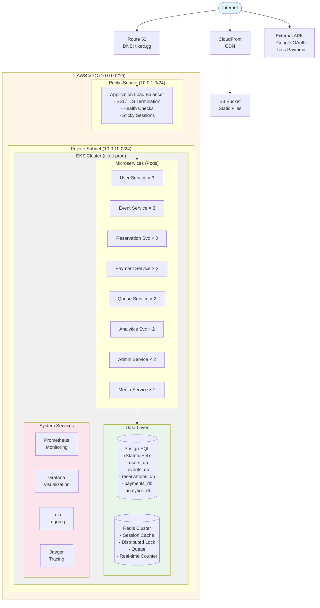

---

## 🎨 마이크로서비스 아키텍처

### Service Mesh Architecture

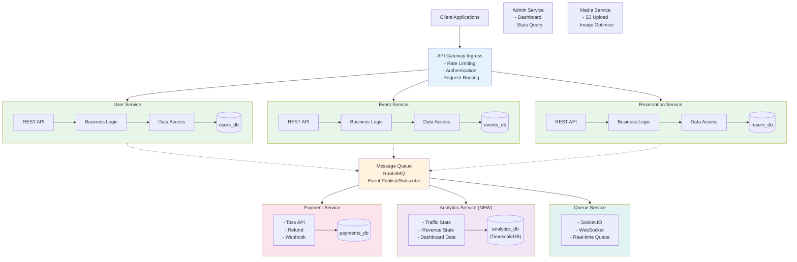

### Service Communication - Reservation Flow Example

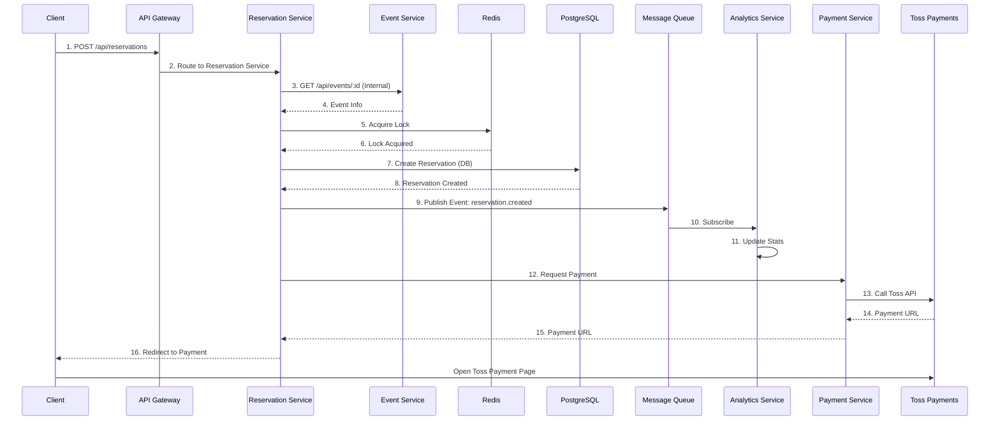

---

## ☸️ K8s 클러스터 아키텍처

### Cluster Topology

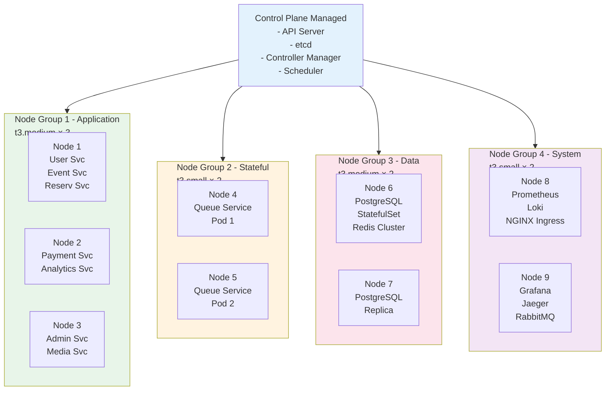

### Namespace Isolation

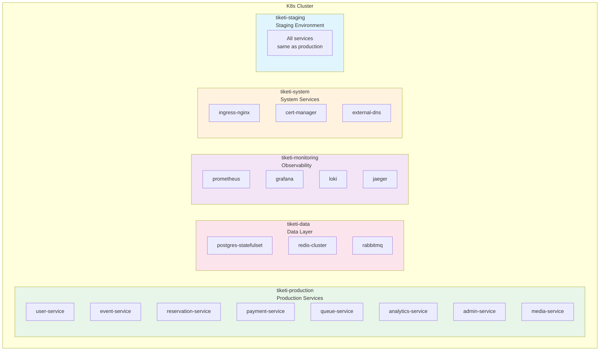

---

## 🔍 서비스별 상세 아키텍처

### Payment Service Architecture

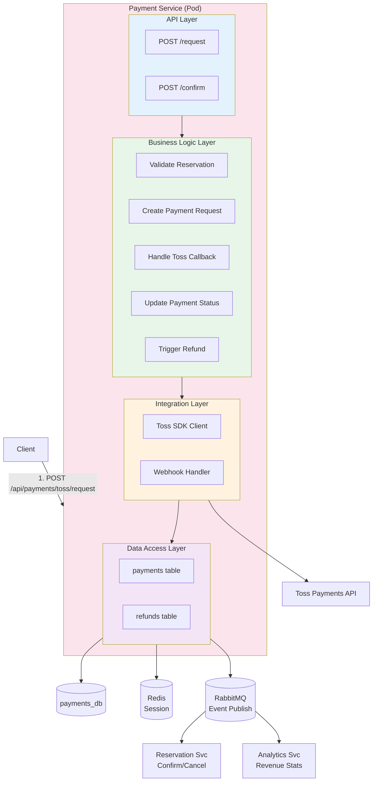

### Payment Flow Sequence

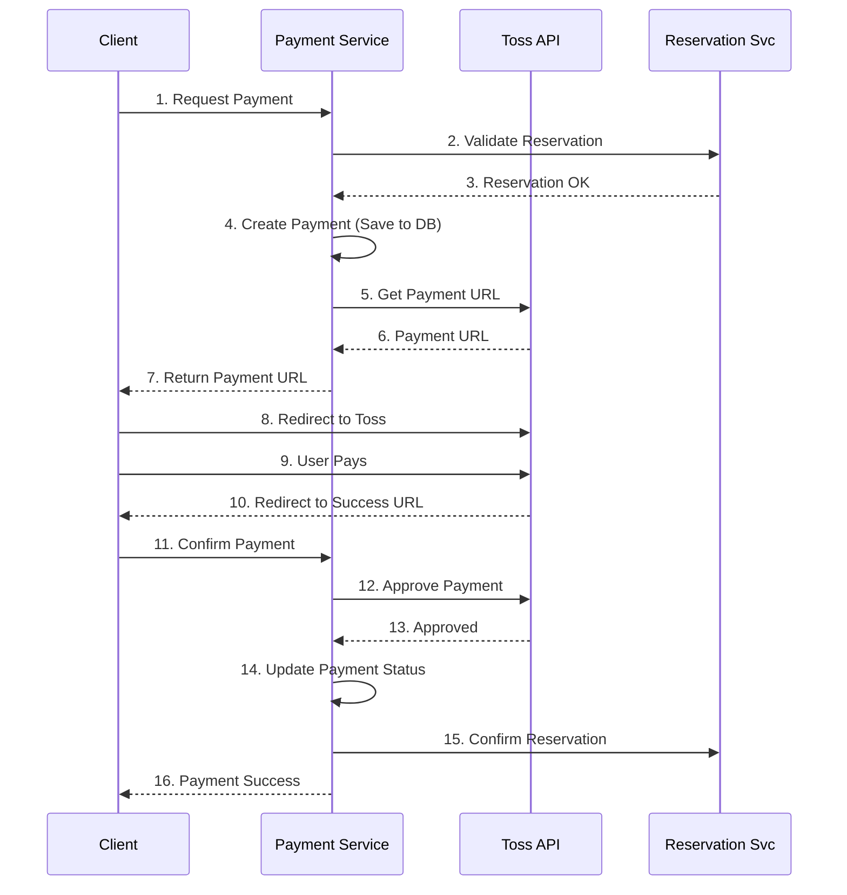

### Analytics Service Architecture

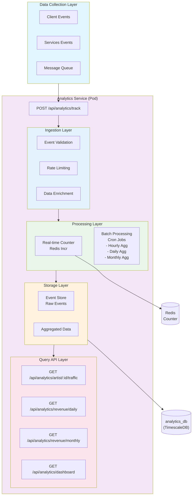

### Data Aggregation Pipeline

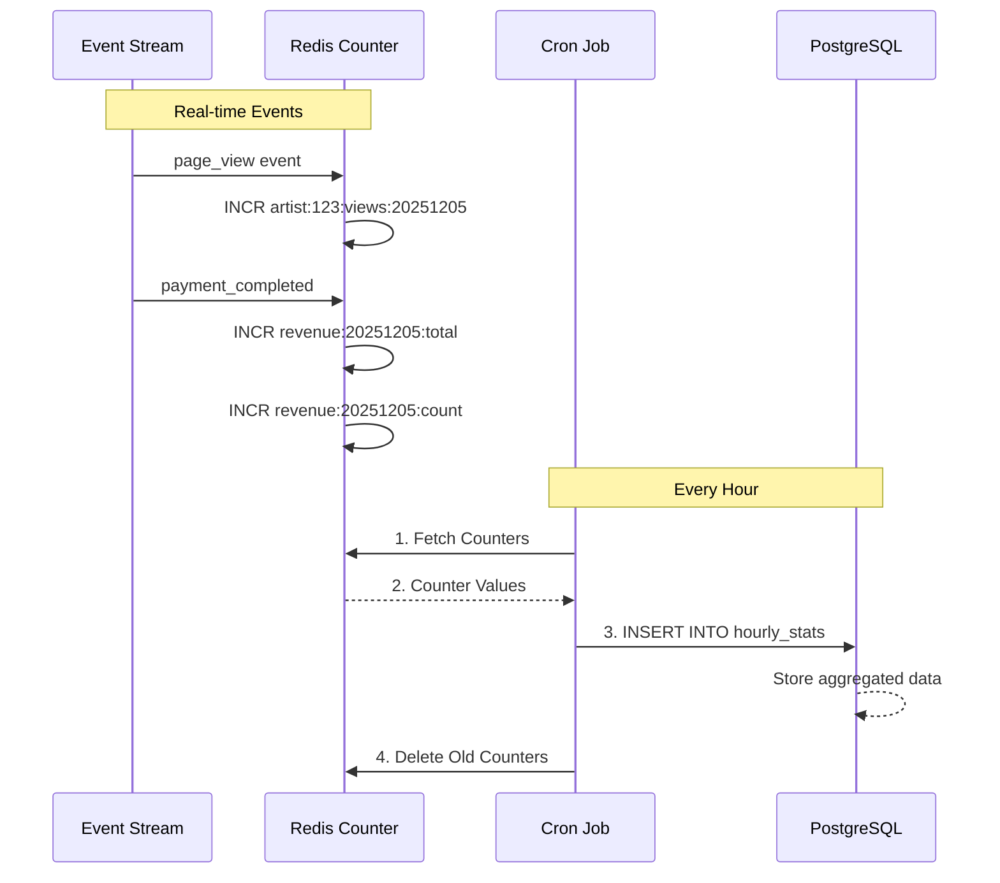

---

## 🔄 데이터 플로우

### Complete Ticket Reservation Flow

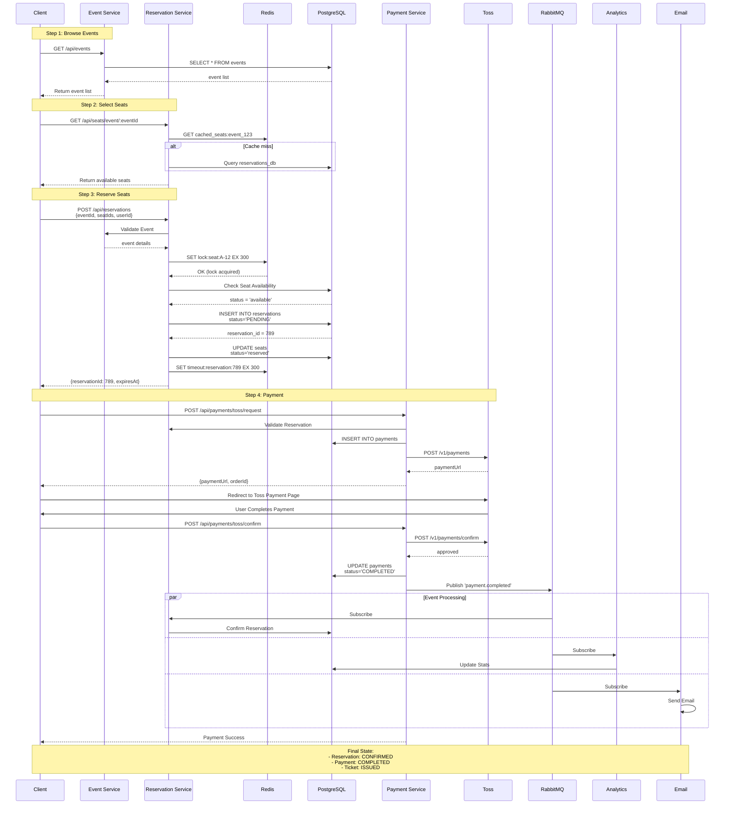

---

## 🚀 배포 아키텍처

### CI/CD Pipeline

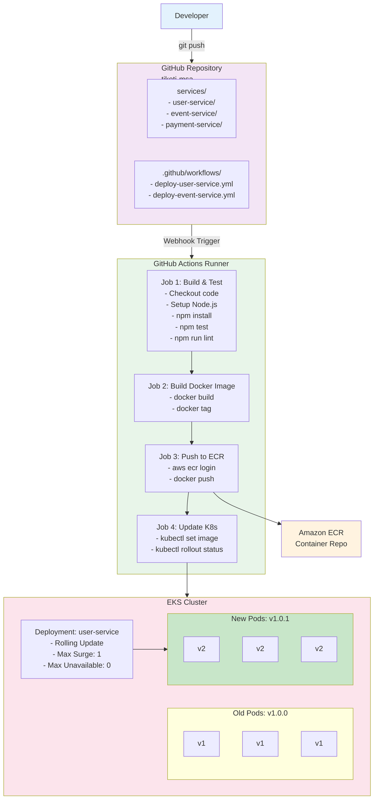

### Deployment Strategies

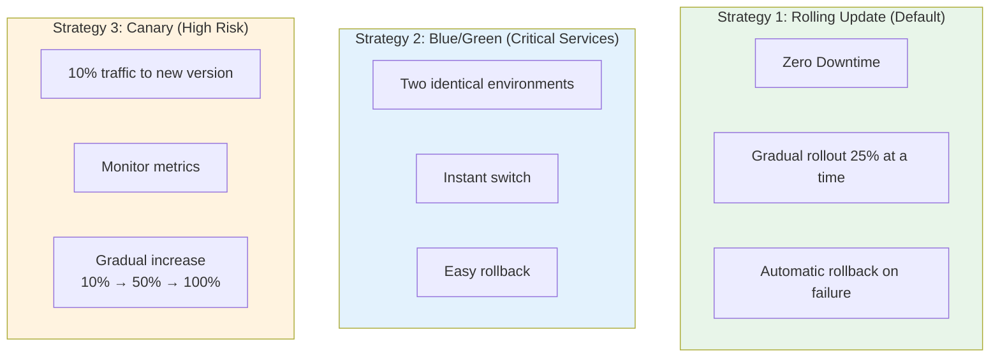

### Multi-Environment Architecture

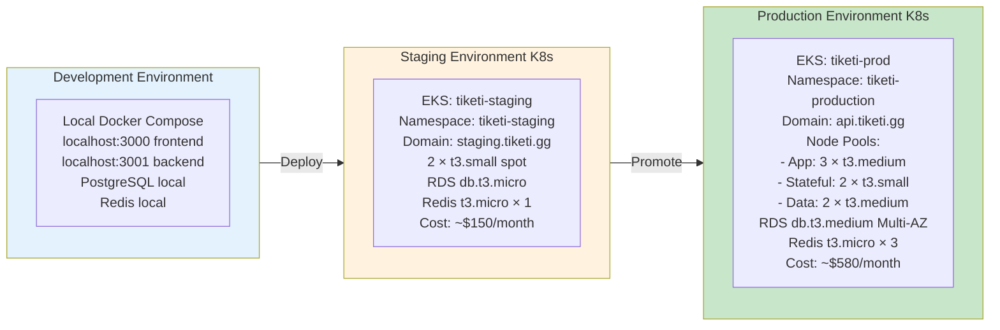

---

## 📊 모니터링 아키텍처

### Observability Stack

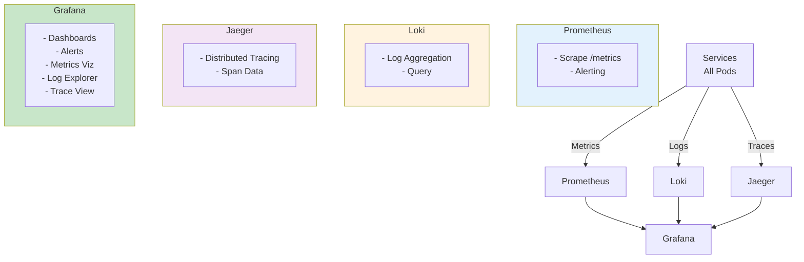

### Monitoring Dashboard Example

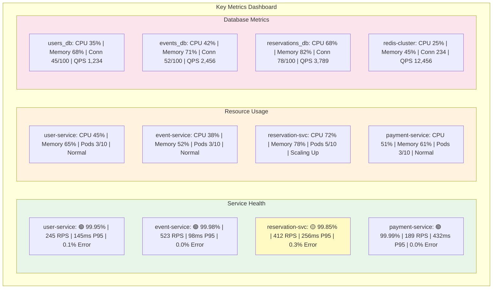

---

**작성일**: 2025-12-11
**버전**: 1.0 (Mermaid)
**변환**: ASCII → Mermaid Diagrams
**작성자**: Claude
