# Tiketi K8s MSA 아키텍처 다이어그램 (Mermaid)

## 📐 목차
1. [전체 시스템 아키텍처](#전체-시스템-아키텍처)
2. [마이크로서비스 아키텍처](#마이크로서비스-아키텍처)
3. [K8s 클러스터 아키텍처](#k8s-클러스터-아키텍처)
4. [서비스별 상세 아키텍처](#서비스별-상세-아키텍처)
5. [데이터 플로우](#데이터-플로우)
6. [배포 아키텍처](#배포-아키텍처)
7. [모니터링 아키텍처](#모니터링-아키텍처)

---

## 🌐 전체 시스템 아키텍처

### High-Level Architecture

---

## 🎨 마이크로서비스 아키텍처

### Service Mesh Architecture

### Service Communication - Reservation Flow Example

---

## ☸️ K8s 클러스터 아키텍처

### Cluster Topology

### Namespace Isolation

---

## 🔍 서비스별 상세 아키텍처

### Payment Service Architecture

### Payment Flow Sequence

### Analytics Service Architecture

### Data Aggregation Pipeline

---

## 🔄 데이터 플로우

### Complete Ticket Reservation Flow

---

## 🚀 배포 아키텍처

### CI/CD Pipeline

### Deployment Strategies

```mermaid
graph TB
    subgraph Strategy1["Strategy 1: Rolling Update (Default)"]
        R1[Zero Downtime]
        R2[Gradual rollout 25% at a time]
        R3[Automatic rollback on failure]
    end

    subgraph Strategy2["Strategy 2: Blue/Green (Critical Services)"]
        B1[Two identical environments]
        B2[Instant switch]
        B3[Easy rollback]
    end

    subgraph Strategy3["Strategy 3: Canary (High Risk)"]
        C1[10% traffic to new version]
        C2[Monitor metrics]
        C3[Gradual increase<br/>10% → 50% → 100%]
    end

    style Strategy1 fill:#e8f5e9
    style Strategy2 fill:#e3f2fd
    style Strategy3 fill:#fff3e0
```

### Multi-Environment Architecture

---

## 📊 모니터링 아키텍처

### Observability Stack

### Monitoring Dashboard Example

```mermaid
graph TB
    subgraph Dashboard["Key Metrics Dashboard"]
        subgraph ServiceHealth["Service Health"]
            SH1["user-service: 🟢 99.95% | 245 RPS | 145ms P95 | 0.1% Error"]
            SH2["event-service: 🟢 99.98% | 523 RPS | 98ms P95 | 0.0% Error"]
            SH3["reservation-svc: 🟡 99.85% | 412 RPS | 256ms P95 | 0.3% Error"]
            SH4["payment-service: 🟢 99.99% | 189 RPS | 432ms P95 | 0.0% Error"]
        end

        subgraph ResourceUsage["Resource Usage"]
            RU1["user-service: CPU 45% | Memory 65% | Pods 3/10 | Normal"]
            RU2["event-service: CPU 38% | Memory 52% | Pods 3/10 | Normal"]
            RU3["reservation-svc: CPU 72% | Memory 78% | Pods 5/10 | Scaling Up"]
            RU4["payment-service: CPU 51% | Memory 61% | Pods 3/10 | Normal"]
        end

        subgraph Database["Database Metrics"]
            DB1["users_db: CPU 35% | Memory 68% | Conn 45/100 | QPS 1,234"]
            DB2["events_db: CPU 42% | Memory 71% | Conn 52/100 | QPS 2,456"]
            DB3["reservations_db: CPU 68% | Memory 82% | Conn 78/100 | QPS 3,789"]
            DB4["redis-cluster: CPU 25% | Memory 45% | Conn 234 | QPS 12,456"]
        end
    end

    style ServiceHealth fill:#e8f5e9
    style ResourceUsage fill:#fff3e0
    style Database fill:#fce4ec
    style SH3 fill:#fff9c4
```

---

**작성일**: 2025-12-11
**버전**: 1.0 (Mermaid)
**변환**: ASCII → Mermaid Diagrams
**작성자**: Claude
