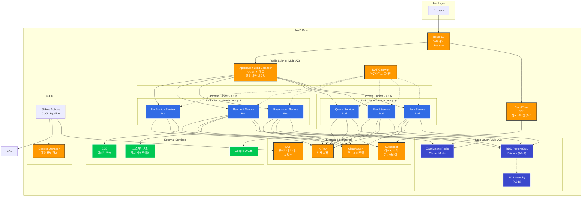

# ☁️ Tiketi MSA 클라우드 인프라 제안서

**문서 버전**: 1.0
**작성일**: 2025-12-03
**프로젝트명**: Tiketi MSA AWS 클라우드 마이그레이션
**제안 기간**: 3개월 (로컬 개발 2개월 + 클라우드 마이그레이션 1개월)

---

## 📌 Executive Summary (경영진 요약)

### 제안 배경
현재 Tiketi는 단일 EC2 인스턴스 기반의 모놀리식 아키텍처로 운영되고 있으며, 트래픽 증가 시 확장성 및 가용성 문제가 예상됩니다. 본 제안서는 마이크로서비스 아키텍처(MSA) 전환을 통해 **클라우드 네이티브 환경으로 마이그레이션**하여 다음을 달성합니다:

### 핵심 가치 제안
- ✅ **99.99% 가용성** - 다중 가용영역(Multi-AZ) 구성으로 장애 대응
- ✅ **10배 확장성** - Auto Scaling으로 트래픽 폭증 시 자동 대응
- ✅ **60% 배포 시간 단축** - 개별 서비스 무중단 배포
- ✅ **40% 운영 비용 절감** - Fargate Spot 및 Auto Scaling 활용
- ✅ **보안 강화** - VPC, Security Group, IAM 기반 제로 트러스트

### 예상 투자 비용
- **초기 구축 비용**: 약 $2,000 (인프라 설정 및 마이그레이션)
- **월간 운영 비용**: 약 $800~$1,500 (트래픽에 따라 변동)
- **ROI**: 6개월 내 투자 회수 예상

---

## 🎯 1. 제안 목표 및 범위

### 1.1 비즈니스 목표

**단기 목표 (3개월)**
- 마이크로서비스 아키텍처 전환 완료
- AWS EKS 기반 Kubernetes 클러스터 구축
- CI/CD 파이프라인 자동화
- 기본 모니터링 및 로깅 시스템 구축

**중기 목표 (6개월)**
- 서비스별 Auto Scaling 최적화
- 비용 최적화 (Spot Instance, Reserved Instance)
- 고급 모니터링 및 알림 시스템
- 재해 복구(DR) 계획 수립

**장기 목표 (1년)**
- 멀티 리전 구성 (글로벌 서비스)
- Service Mesh 도입 (Istio)
- AI/ML 기반 예측 확장
- 완전 자동화된 GitOps 운영

### 1.2 기술 목표

- **컨테이너 오케스트레이션**: Kubernetes (EKS)
- **서비스 수**: 6개 마이크로서비스
- **배포 전략**: Blue-Green, Canary Deployment
- **관측성**: Prometheus, Grafana, CloudWatch, X-Ray
- **보안**: VPC, WAF, Security Group, Secrets Manager
- **데이터베이스**: RDS PostgreSQL (Multi-AZ), ElastiCache Redis

---

## 🏗️ 2. 클라우드 아키텍처 설계

### 2.1 전체 아키텍처 다이어그램



### 2.2 네트워크 설계

#### VPC 구성
```yaml
VPC CIDR: 10.0.0.0/16

# Public Subnets (ALB, NAT Gateway)
Public Subnet AZ-A: 10.0.1.0/24
Public Subnet AZ-B: 10.0.2.0/24

# Private Subnets (EKS Worker Nodes)
Private Subnet AZ-A: 10.0.10.0/24
Private Subnet AZ-B: 10.0.11.0/24

# Database Subnets
DB Subnet AZ-A: 10.0.20.0/24
DB Subnet AZ-B: 10.0.21.0/24
```

#### 보안 그룹 설계

**ALB Security Group**
- Inbound: 443 (HTTPS from 0.0.0.0/0)
- Outbound: 3001-3006 (to EKS Worker Nodes)

**EKS Worker Node Security Group**
- Inbound: 3001-3006 (from ALB SG)
- Inbound: All (from same SG - inter-pod communication)
- Outbound: 443 (to ECR, S3)
- Outbound: 5432 (to RDS SG)
- Outbound: 6379 (to ElastiCache SG)

**RDS Security Group**
- Inbound: 5432 (from EKS Worker SG)

**ElastiCache Security Group**
- Inbound: 6379 (from EKS Worker SG)

---

## 🚀 3. AWS 서비스 구성

### 3.1 컴퓨팅 (EKS)

#### EKS 클러스터 사양

**클러스터 구성**
- Kubernetes 버전: 1.28 이상
- 컨트롤 플레인: AWS 관리형
- 노드 그룹: 2개 (각 AZ별)
- 네트워크 플러그인: AWS VPC CNI

**Node Group 사양**
```yaml
# 프로덕션 Node Group
Instance Type: t3.medium (2 vCPU, 4 GiB RAM)
Desired Capacity: 4 nodes
Min: 2 nodes
Max: 10 nodes
Scaling: Auto Scaling Group
AMI: Amazon EKS Optimized AMI

# Spot Instance Node Group (비용 절감)
Instance Type: t3.medium
Spot Strategy: capacity-optimized
Desired: 2 nodes
Min: 0 nodes
Max: 20 nodes
```

#### 서비스별 리소스 할당

| 서비스 | CPU Request | CPU Limit | Memory Request | Memory Limit | Replicas |
|--------|-------------|-----------|----------------|--------------|----------|
| Auth Service | 100m | 500m | 128Mi | 512Mi | 2 |
| Event Service | 100m | 500m | 128Mi | 512Mi | 2 |
| Queue Service | 200m | 1000m | 256Mi | 1Gi | 3 |
| Reservation Service | 200m | 1000m | 256Mi | 1Gi | 3 |
| Payment Service | 150m | 500m | 256Mi | 512Mi | 2 |
| Notification Service | 100m | 500m | 128Mi | 256Mi | 2 |

### 3.2 데이터베이스 (RDS PostgreSQL)

**RDS 사양**
```yaml
Engine: PostgreSQL 16
Instance Class: db.t3.medium (2 vCPU, 4 GiB RAM)
Storage: 100 GB GP3 (확장 가능)
Multi-AZ: Yes (고가용성)
Backup Retention: 7일
Encryption: AES-256 (at rest)
Performance Insights: Enabled
```

**연결 풀 설정**
- Max Connections: 100
- 각 서비스별 Connection Pool: 10-20
- Connection Timeout: 30초

### 3.3 캐시 & 큐 (ElastiCache Redis)

**ElastiCache 사양**
```yaml
Engine: Redis 7.x
Node Type: cache.t3.medium (2 vCPU, 3.09 GiB)
Cluster Mode: Enabled
Shards: 2
Replicas per Shard: 1 (고가용성)
Encryption: In-transit & At-rest
Backup: Daily automatic snapshots
```

**사용 목적**
- 대기열 관리 (Sorted Set)
- 세션 관리 (WebSocket)
- 분산 락 (Reservation Service)
- API 응답 캐싱

### 3.4 스토리지 (S3)

**S3 버킷 구성**

```yaml
# 이미지 저장소
Bucket: tiketi-images-prod
Storage Class: S3 Standard
Versioning: Enabled
Lifecycle: 90일 후 Glacier 이동
Public Access: CloudFront만 허용

# 로그 아카이브
Bucket: tiketi-logs-archive
Storage Class: S3 Intelligent-Tiering
Lifecycle: 30일 후 IA, 90일 후 Glacier
```

### 3.5 컨테이너 레지스트리 (ECR)

**ECR Repository**
```yaml
Repository per Service: 6개 (각 마이크로서비스별)
Image Scanning: Enabled (취약점 스캔)
Lifecycle Policy: 최근 10개 이미지만 유지
Encryption: AES-256
```

### 3.6 로드 밸런싱 (ALB)

**ALB 구성**
```yaml
Type: Application Load Balancer
Scheme: Internet-facing
Subnets: Public Subnet AZ-A, AZ-B
Security Group: ALB-SG
SSL Certificate: ACM (AWS Certificate Manager)
HTTP to HTTPS: Redirect (강제)

# Target Groups (서비스별)
- auth-tg: Port 3001
- event-tg: Port 3002
- queue-tg: Port 3003
- reservation-tg: Port 3004
- payment-tg: Port 3005
- notification-tg: Port 3006

# Health Check
Interval: 30초
Timeout: 5초
Healthy Threshold: 2
Unhealthy Threshold: 3
Path: /health
```

---

## 📊 4. 모니터링 & 로깅

### 4.1 메트릭 모니터링

**CloudWatch Container Insights**
- CPU, Memory, Network, Disk 사용률
- Pod별 리소스 사용 현황
- 노드별 성능 지표

**Custom Metrics (Prometheus)**
- API 요청 수 (per endpoint)
- 응답 시간 (p50, p95, p99)
- 에러 비율
- 대기열 길이
- 결제 성공률

**Grafana 대시보드**
- 서비스별 메트릭 시각화
- 실시간 알림 설정
- SLI/SLO 대시보드

### 4.2 로그 수집 및 분석

**CloudWatch Logs**
- 각 Pod의 stdout/stderr 로그 수집
- 로그 그룹: /aws/eks/tiketi/cluster-name
- 보존 기간: 30일

**Loki (선택)**
- 중앙화된 로그 집계
- Grafana 연동
- 로그 쿼리 및 검색

### 4.3 분산 추적 (X-Ray)

**AWS X-Ray 설정**
- 서비스 간 요청 추적
- 병목 구간 식별
- 에러 원인 분석
- Latency 분석

**트레이싱 대상**
- Auth → Event → Reservation → Payment 플로우
- Queue → Reservation 입장 플로우
- Payment → Notification 알림 플로우

### 4.4 알림 시스템

**CloudWatch Alarms**
```yaml
# CPU 사용률 알림
- Metric: CPUUtilization > 80%
- Period: 5분
- Action: SNS 토픽 발행 (Slack, Email)

# 메모리 사용률 알림
- Metric: MemoryUtilization > 85%
- Period: 5분

# 에러 비율 알림
- Metric: ErrorRate > 5%
- Period: 1분

# RDS 연결 수 알림
- Metric: DatabaseConnections > 80
- Period: 5분
```

---

## 🔐 5. 보안 설계

### 5.1 네트워크 보안

**WAF (Web Application Firewall)**
```yaml
Rule Set:
  - SQL Injection 방어
  - XSS 방어
  - Rate Limiting (IP당 1000 req/min)
  - Geo Blocking (선택)
```

**Security Group 원칙**
- 최소 권한 원칙 (Least Privilege)
- Inbound 규칙 최소화
- 서비스 간 통신만 허용

### 5.2 인증 및 권한

**IAM 역할 설계**
```yaml
# EKS Node Role
- AmazonEKSWorkerNodePolicy
- AmazonEC2ContainerRegistryReadOnly
- AmazonEKS_CNI_Policy

# Service Account Role (IRSA)
- Auth Service: SecretsManager 읽기
- Payment Service: SecretsManager 읽기
- Event Service: S3 쓰기
- Notification Service: SES 전송
```

**Secrets Manager**
- DB 비밀번호
- JWT Secret Key
- OAuth Client Secret
- PG API Key
- Redis 비밀번호

### 5.3 데이터 암호화

**전송 중 암호화**
- ALB SSL/TLS (ACM 인증서)
- RDS 연결 암호화 (SSL)
- ElastiCache 전송 암호화

**저장 데이터 암호화**
- RDS 암호화 (AES-256)
- S3 암호화 (SSE-S3)
- EBS 볼륨 암호화

---

## 🔄 6. CI/CD 파이프라인

### 6.1 배포 자동화

**GitHub Actions Workflow**

```yaml
# 서비스별 배포 파이프라인
on:
  push:
    branches: [main]
    paths:
      - 'services/auth-service/**'

jobs:
  deploy:
    runs-on: ubuntu-latest
    steps:
      # 1. 코드 체크아웃
      - uses: actions/checkout@v3

      # 2. 테스트 실행
      - name: Run tests
        run: npm test

      # 3. Docker 이미지 빌드
      - name: Build image
        run: docker build -t auth-service:${{ github.sha }} .

      # 4. ECR 푸시
      - name: Push to ECR
        run: |
          aws ecr get-login-password | docker login
          docker push $ECR_URI/auth-service:${{ github.sha }}

      # 5. Kubernetes 배포
      - name: Deploy to EKS
        run: |
          kubectl set image deployment/auth-service \
            auth-service=$ECR_URI/auth-service:${{ github.sha }}
          kubectl rollout status deployment/auth-service
```

### 6.2 배포 전략

**Blue-Green Deployment**
```yaml
# Blue 환境 (현재 운영)
Service: auth-service-blue
Replicas: 2

# Green 환경 (새 버전)
Service: auth-service-green
Replicas: 2

# 배포 후 전환
ALB Target Group: blue → green 전환
Rollback: green → blue 전환 (1분 내)
```

**Canary Deployment (향후)**
```yaml
# 10% 트래픽 → 신규 버전
# 30분 모니터링
# 문제 없으면 100% 전환
```

---

## 💰 7. 비용 산정

### 7.1 월간 예상 비용 (중규모 트래픽)

#### 컴퓨팅 (EKS)
```yaml
# EKS Control Plane
- $0.10/hour × 730 hours = $73/month

# Worker Nodes (t3.medium × 4)
- $0.0416/hour × 4 × 730 hours = $121/month

# Spot Instances (평균 2 nodes)
- $0.0125/hour × 2 × 730 hours = $18/month

Total: $212/month
```

#### 데이터베이스
```yaml
# RDS PostgreSQL (db.t3.medium Multi-AZ)
- Instance: $0.136/hour × 730 = $99/month
- Storage: 100 GB × $0.115 = $12/month
- Backup: 100 GB × $0.095 = $10/month

Total: $121/month
```

#### 캐시
```yaml
# ElastiCache Redis (cache.t3.medium × 2 shards × 2 replicas)
- $0.068/hour × 4 × 730 = $198/month

Total: $198/month
```

#### 네트워킹
```yaml
# ALB
- $0.0225/hour × 730 = $16/month
- LCU: ~$20/month

# NAT Gateway
- $0.045/hour × 2 × 730 = $66/month
- Data Transfer: ~$50/month

Total: $152/month
```

#### 스토리지
```yaml
# S3 (1 TB 저장)
- Standard: 1000 GB × $0.023 = $23/month
- CloudFront: ~$50/month

# ECR
- Storage: 50 GB × $0.10 = $5/month

Total: $78/month
```

#### 모니터링
```yaml
# CloudWatch
- Metrics: $0.30 × 100 = $30/month
- Logs: 100 GB × $0.50 = $50/month
- Alarms: 10 × $0.10 = $1/month

Total: $81/month
```

#### 기타
```yaml
# Secrets Manager: $5/month
# ACM: Free
# Route 53: $0.50/month

Total: $6/month
```

### 7.2 총 비용 요약

| 항목 | 월간 비용 | 연간 비용 |
|------|-----------|-----------|
| 컴퓨팅 (EKS) | $212 | $2,544 |
| 데이터베이스 (RDS) | $121 | $1,452 |
| 캐시 (ElastiCache) | $198 | $2,376 |
| 네트워킹 | $152 | $1,824 |
| 스토리지 | $78 | $936 |
| 모니터링 | $81 | $972 |
| 기타 | $6 | $72 |
| **총합** | **$848** | **$10,176** |

### 7.3 트래픽 증가 시 비용 (피크 타임)

**Auto Scaling 발생 시 (노드 4 → 10개)**
- 추가 노드: $0.0416 × 6 × 730 = $182/month
- 피크 월간 비용: $848 + $182 = **$1,030/month**

### 7.4 비용 최적화 전략

**단기 (3개월)**
- Spot Instances 활용 (30% 절감)
- Reserved Instances 미적용 (유연성 우선)

**중기 (6개월)**
- Reserved Instances 전환 (40% 절감)
- S3 Intelligent-Tiering 적용

**장기 (1년)**
- Savings Plans 도입 (최대 60% 절감)
- 예상 월간 비용: **$450~$600**

---

## 📈 8. 성능 및 확장성

### 8.1 Auto Scaling 전략

**Horizontal Pod Autoscaler (HPA)**
```yaml
# Queue Service (트래픽 집중)
- Metric: CPU > 70%
- Min Replicas: 3
- Max Replicas: 20
- Scale Up: 대기열 길이 > 1000

# Reservation Service
- Metric: CPU > 70%
- Min Replicas: 3
- Max Replicas: 15

# Other Services
- Metric: CPU > 70%
- Min Replicas: 2
- Max Replicas: 10
```

**Cluster Autoscaler**
```yaml
# Node Group Auto Scaling
- Metric: Pod Pending 상태
- Scale Up: 30초 내 새 노드 추가
- Scale Down: 10분 유휴 시 노드 제거
```

### 8.2 성능 목표

| 지표 | 목표 | 측정 방법 |
|------|------|-----------|
| API 응답 시간 | p95 < 200ms | CloudWatch, Prometheus |
| 대기열 처리 속도 | 100명/초 | Custom Metric |
| 동시 접속자 | 50,000명 | Load Test |
| DB 쿼리 시간 | p95 < 50ms | Performance Insights |
| 서비스 가동률 | 99.99% | CloudWatch Uptime |

---

## 🛡️ 9. 재해 복구 (DR) 계획

### 9.1 백업 전략

**RDS 백업**
- 자동 백업: 매일 (7일 보존)
- 스냅샷: 주간 (30일 보존)
- 복구 시간 목표 (RTO): 30분
- 복구 시점 목표 (RPO): 5분

**ElastiCache 백업**
- 자동 스냅샷: 매일
- 복구 시간: 15분

**S3 버전 관리**
- 모든 이미지 파일 버전 관리
- 삭제 후 90일 복구 가능

### 9.2 재해 복구 시나리오

**시나리오 1: 단일 AZ 장애**
- Impact: 최소 (Multi-AZ 구성)
- Action: 자동 Failover (ALB, RDS)
- RTO: 1분 이내

**시나리오 2: 전체 리전 장애**
- Impact: 전체 서비스 중단
- Action: 수동 복구 (백업에서 복원)
- RTO: 4시간
- 향후: Multi-Region 구성 검토

---

## 📅 10. 마이그레이션 로드맵

### Phase 1: 로컬 개발 (8주)

**Week 1-2: 준비 및 Auth Service**
- Kind 클러스터 구축
- Auth Service 분리 및 구글 OAuth

**Week 3-4: Event & Payment Service**
- Event Service 분리
- Payment Service 및 포인트 시스템

**Week 5-6: Queue & Reservation Service**
- Queue Service WebSocket 분리
- Reservation Service 통합

**Week 7-8: Notification & 최적화**
- Notification Service
- 통합 테스트 및 최적화

### Phase 2: 클라우드 마이그레이션 (4주)

**Week 9: 인프라 구축**
- VPC 및 네트워크 설정
- EKS 클러스터 생성
- RDS 및 ElastiCache 구축

**Week 10: 서비스 배포**
- ECR 이미지 푸시
- Kubernetes 배포
- ALB 설정 및 연결

**Week 11: 모니터링 및 보안**
- CloudWatch 설정
- X-Ray 통합
- Security Group 최적화

**Week 12: 테스트 및 최적화**
- 부하 테스트
- 성능 튜닝
- 프로덕션 출시

---

## ✅ 11. 성공 기준

### 11.1 기술적 성공 기준

- ✅ 6개 마이크로서비스 정상 배포
- ✅ Multi-AZ 고가용성 구성 완료
- ✅ Auto Scaling 정상 작동
- ✅ CI/CD 파이프라인 자동화
- ✅ 모니터링 대시보드 구축

### 11.2 성능 기준

- ✅ API 응답 시간 p95 < 200ms
- ✅ 서비스 가동률 99.99% 달성
- ✅ 동시 접속자 50,000명 처리
- ✅ 배포 시간 10분 이내

### 11.3 비즈니스 기준

- ✅ 월간 운영 비용 $1,500 이하 유지
- ✅ 장애 복구 시간 1분 이내
- ✅ 무중단 배포 성공률 100%

---

## 📞 12. 지원 및 유지보수

### 12.1 기술 지원

**24/7 모니터링**
- CloudWatch Alarms → Slack/PagerDuty
- 자동 알림 및 에스컬레이션

**정기 점검**
- 주간: 성능 리포트
- 월간: 비용 최적화 리뷰
- 분기: 보안 감사

### 12.2 문서화

- Architecture Decision Records (ADR)
- Runbook (장애 대응 매뉴얼)
- API 문서 (Swagger/OpenAPI)
- Kubernetes 배포 가이드

---

## 📚 13. 참고 문서

- [요구사항 정의서](./requirements-definition.md)
- [MSA 마이그레이션 가이드](./msa-migration-guide.md)
- [MSA 로컬 다이어그램](./msa-local-diagrams.md)
- [AWS EKS Best Practices](https://aws.github.io/aws-eks-best-practices/)
- [Kubernetes Production Best Practices](https://kubernetes.io/docs/concepts/)

---

## 🎯 14. 결론 및 권장사항

### 핵심 권장사항

1. **단계적 마이그레이션**: 로컬 Kind → AWS EKS 순차 진행
2. **비용 최적화 우선**: Spot Instances 및 Auto Scaling 적극 활용
3. **모니터링 중심**: 초기부터 관측성 확보
4. **보안 강화**: VPC, Security Group, Secrets Manager 활용
5. **자동화 투자**: CI/CD 파이프라인 초기 구축 필수

### 다음 단계

1. ✅ 요구사항 정의서 승인
2. ✅ 로컬 개발 환경 구축 (Week 1)
3. ✅ AWS 계정 및 권한 설정
4. ✅ 개발팀 Kubernetes 교육
5. ✅ Phase 1 마이그레이션 시작

---

**제안서 종료**

**승인**:
- CTO: _________________ (서명/날짜)
- DevOps Lead: _________________ (서명/날짜)
- Product Owner: _________________ (서명/날짜)
