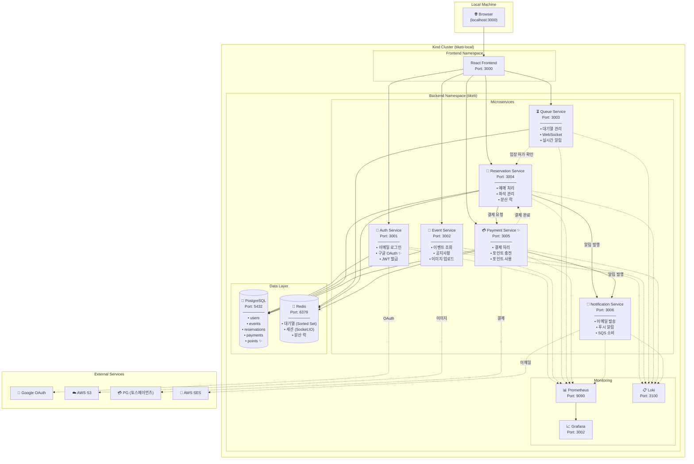
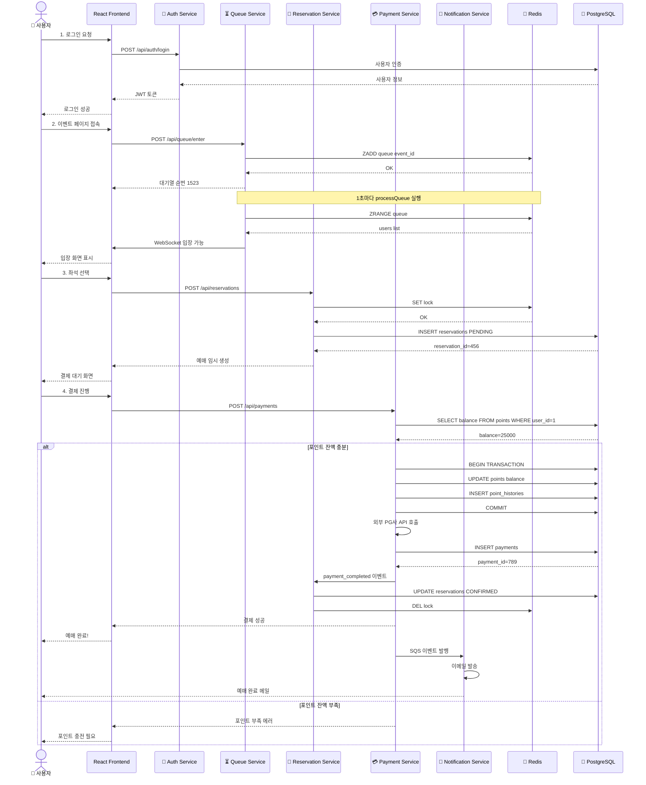
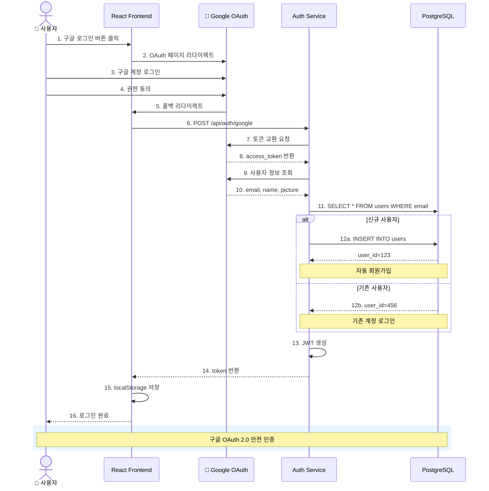
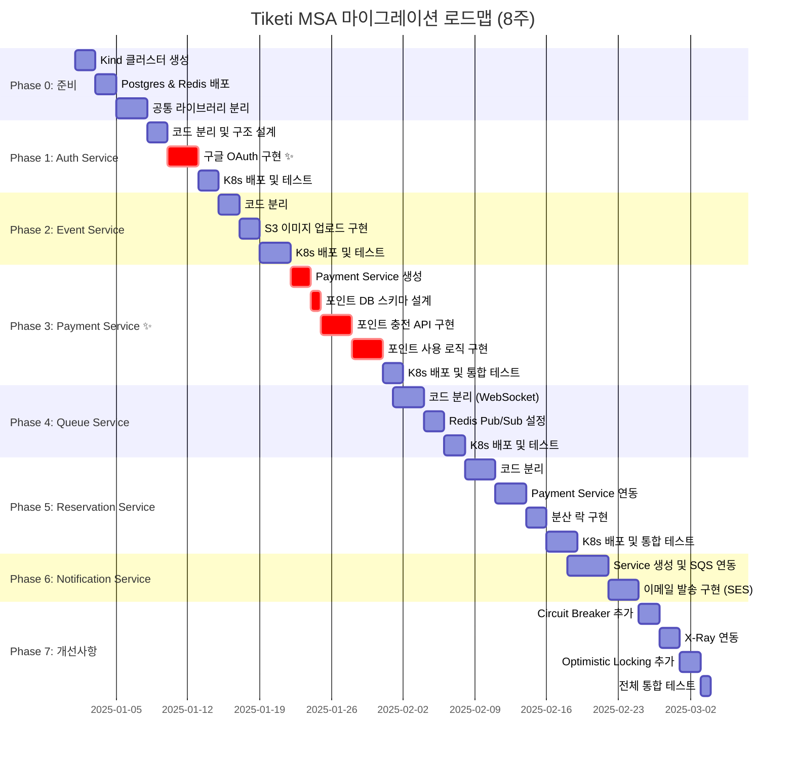
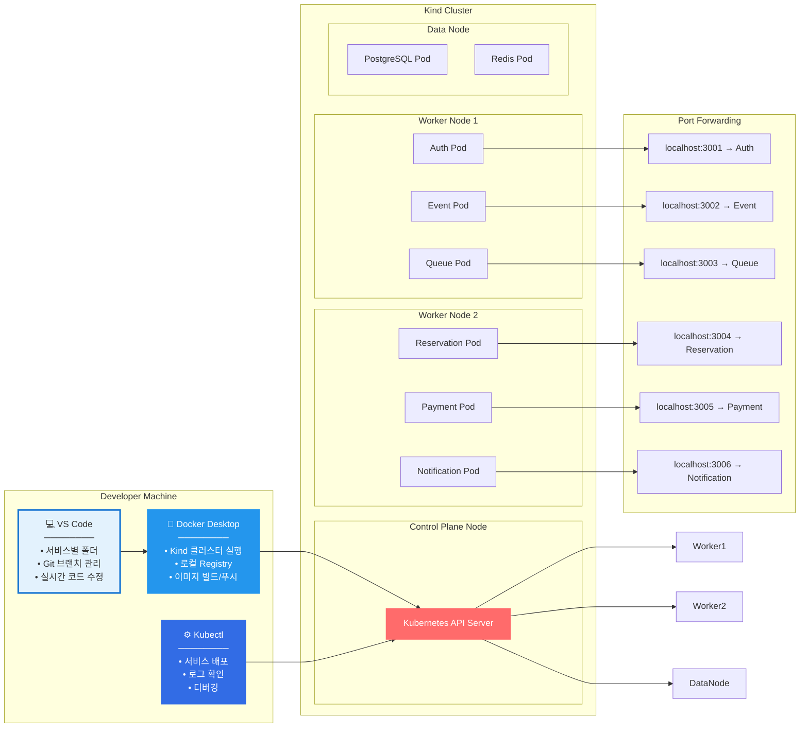
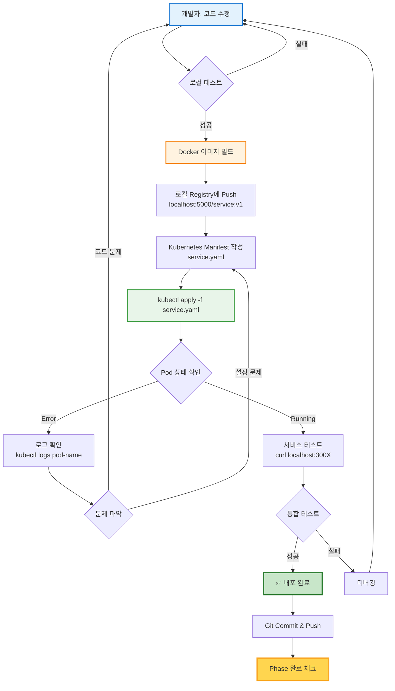
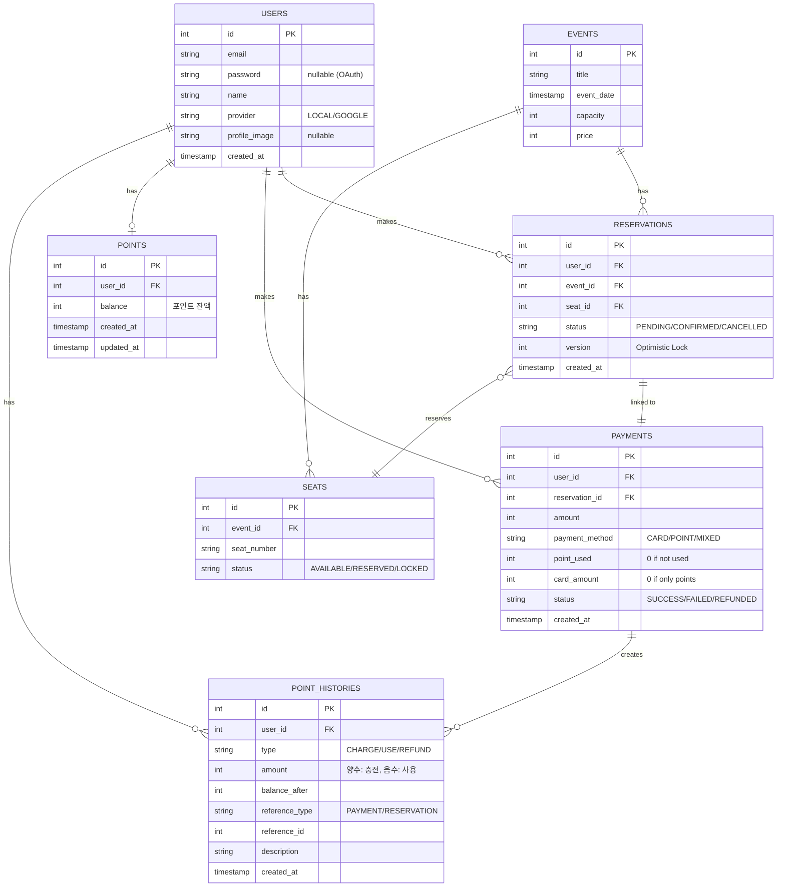
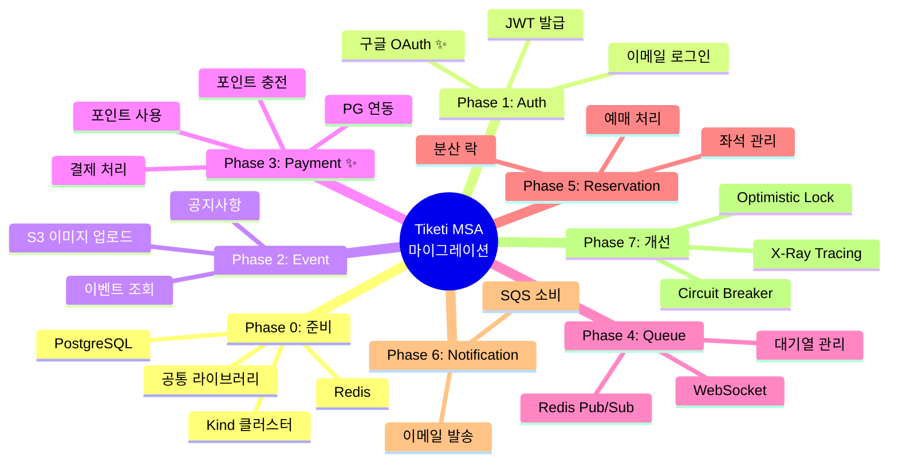
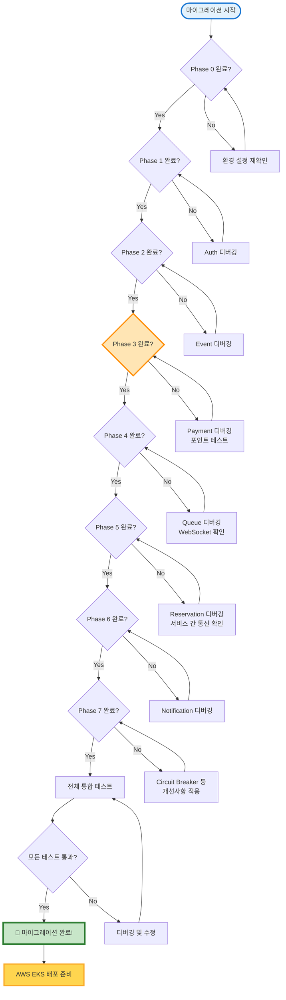

# Tiketi MSA 로컬 아키텍처 다이어그램

## 📊 1. 로컬 Kubernetes 전체 아키텍처

---

## 🔄 2. 서비스 간 통신 흐름 (예매 플로우)

---

## 💰 3. 포인트 시스템 플로우

```mermaid
graph TB
    subgraph "포인트 충전 플로우"
        A1[포인트 충전 요청] --> B1[Payment Service]
        B1 --> C1{PG사 결제}
        C1 -->|성공| D1[points balance 증가]
        C1 -->|실패| E1[충전 실패]
        D1 --> F1[point_histories 기록]
        F1 --> G1[충전 성공]
    end

    subgraph "포인트 사용 플로우"
        A2[예매 + 포인트 사용] --> B2[Payment Service]
        B2 --> C2{포인트 잔액 확인}
        C2 -->|충분| D2[Transaction 시작]
        C2 -->|부족| E2[에러 응답]

        D2 --> F2[balance 차감]
        F2 --> G2[histories 기록]
        G2 --> H2{카드 결제}
        H2 -->|성공| I2[COMMIT]
        H2 -->|실패| J2[ROLLBACK]

        I2 --> K2[예매 확정]
        J2 --> L2[결제 실패]
    end

    subgraph "포인트 환불 플로우"
        A3[예매 취소] --> B3[Reservation Service]
        B3 --> C3[Payment 환불 요청]
        C3 --> D3[balance 증가]
        D3 --> E3[histories 기록]
        E3 --> F3[환불 완료]
    end
```

---

## 🔐 4. 구글 OAuth 로그인 플로우

---

## 📅 5. MSA 마이그레이션 타임라인 (8주)

---

## 🏗️ 6. 로컬 개발 환경 구조

---

## 🔧 7. 서비스 배포 흐름

---

## 📊 8. 데이터베이스 구조 (MSA 관점)

---

## 🎯 9. 마이그레이션 체크포인트

---

## ✅ 마이그레이션 완료 기준

---

## 📚 참고 문서

- [Phase 0: 로컬 환경 구축](./phase0-local-setup.md)
- [Phase 1: Auth Service 마이그레이션](./phase1-auth-service.md)
- [Phase 2: Event Service 마이그레이션](./phase2-event-service.md)
- [Phase 3: Payment Service 구현 (포인트 시스템)](./phase3-payment-service.md)
- [Phase 4: Queue Service 마이그레이션](./phase4-queue-service.md)
- [Phase 5: Reservation Service 마이그레이션](./phase5-reservation-service.md)
- [Phase 6: Notification Service 구현](./phase6-notification-service.md)
- [Phase 7: Circuit Breaker & X-Ray 추가](./phase7-improvements.md)
